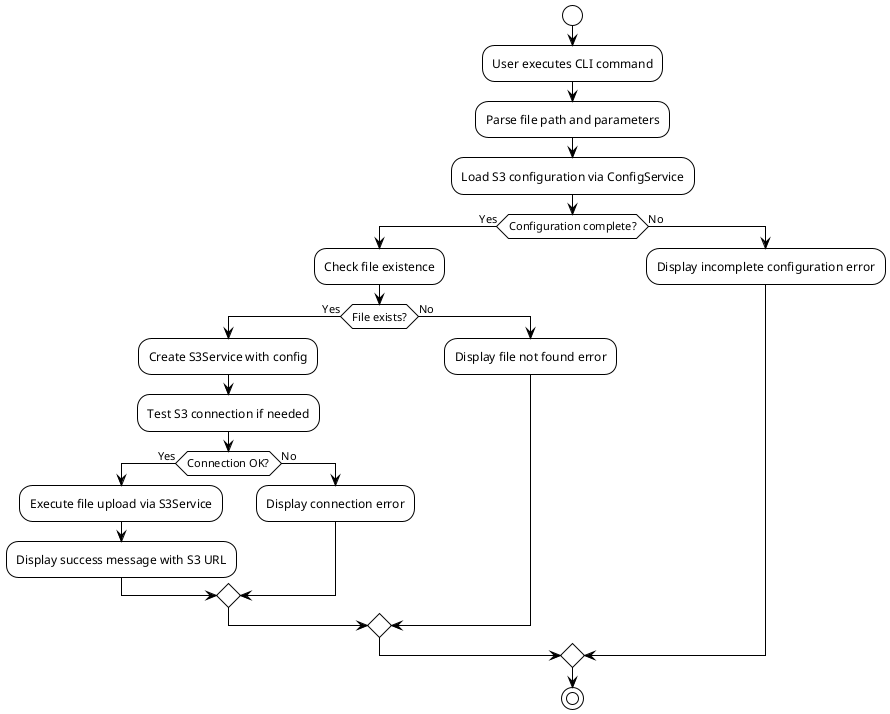
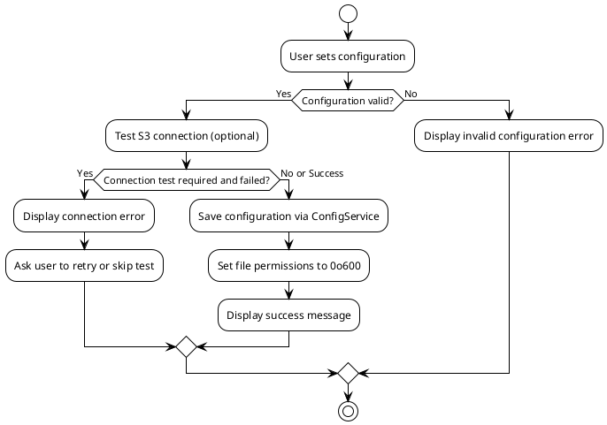
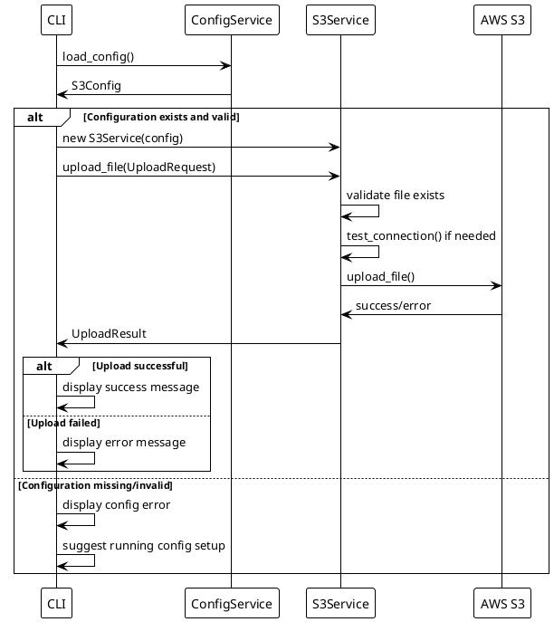

# File Upload Feature Process Flow Design

## 1. Simplified Process Overview



## 2. Configuration Management Process



## 3. CLI Command Structure Design

### 3.1 Configuration Commands
```bash
# Interactive setup
cloud-storage-syncer config setup

# Show current configuration
cloud-storage-syncer config show

# Test S3 connection
cloud-storage-syncer config test

# Remove configuration
cloud-storage-syncer config remove
```

### 3.2 Upload Commands
```bash
# Upload single file
cloud-storage-syncer upload file /path/to/file.txt

# Upload with custom S3 key and storage class
cloud-storage-syncer upload file /path/to/file.txt \
  --s3-key "uploads/file.txt" \
  --storage-class STANDARD_IA

# Upload directory
cloud-storage-syncer upload directory /path/to/dir --recursive

# Upload directory with prefix
cloud-storage-syncer upload directory /path/to/dir \
  --prefix "backup/2024" \
  --recursive

# Batch upload from file list
cloud-storage-syncer upload batch /path/to/filelist.txt
```

## 4. Upload Process Flow



## 4. 基本錯誤處理

簡單的錯誤處理策略：
- 檔案不存在 → 顯示錯誤訊息
- 配置不完整 → 提示設定配置
- S3 操作失敗 → 顯示 boto3 原始錯誤
- 網路問題 → 顯示連接錯誤
