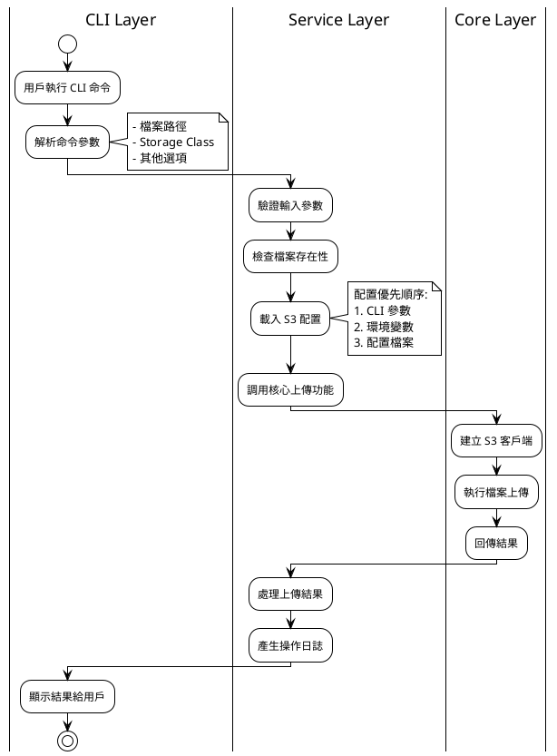
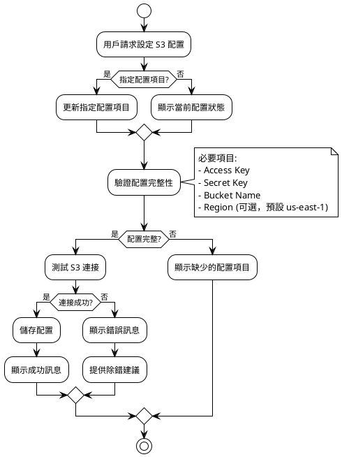
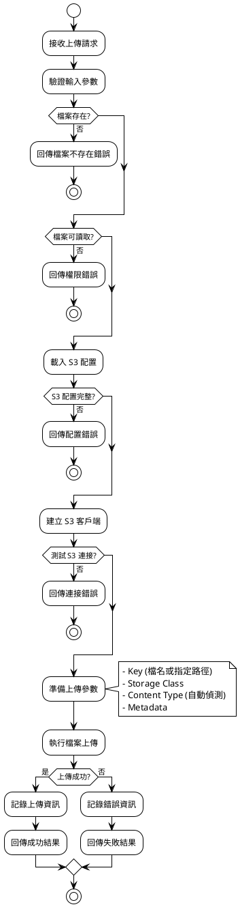
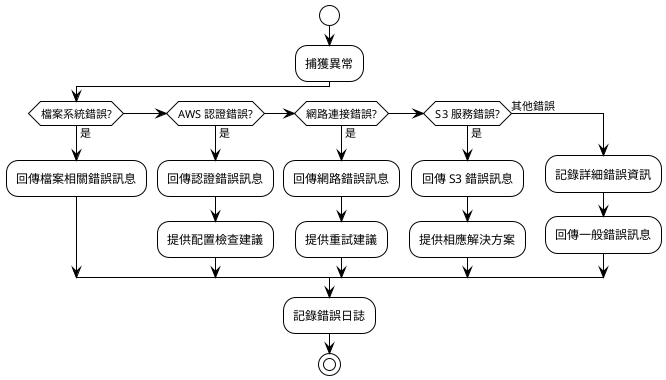
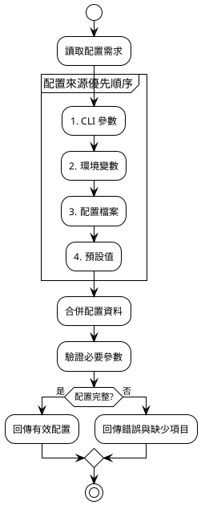

# 檔案上傳功能處理流程設計

## 1. 整體流程概觀



## 2. S3 配置管理流程



## 3. 檔案上傳詳細流程



## 4. 錯誤處理流程



## 5. CLI 命令結構設計

### 5.1 配置命令
```bash
# 設定 AWS 認證資訊
cloud-storage-syncer config set aws-access-key-id YOUR_ACCESS_KEY
cloud-storage-syncer config set aws-secret-access-key YOUR_SECRET_KEY
cloud-storage-syncer config set bucket-name YOUR_BUCKET_NAME
cloud-storage-syncer config set region us-west-2  # 可選

# 查看當前配置
cloud-storage-syncer config show
cloud-storage-syncer config list

# 測試配置
cloud-storage-syncer config test
```

### 5.2 上傳命令
```bash
# 基本上傳 (使用預設 Intelligent-Tiering)
cloud-storage-syncer upload /path/to/file.txt

# 指定 Storage Class
cloud-storage-syncer upload /path/to/file.txt --storage-class STANDARD
cloud-storage-syncer upload /path/to/file.txt --storage-class GLACIER

# 指定 S3 中的檔名
cloud-storage-syncer upload /path/to/file.txt --key my-folder/renamed-file.txt

# 批次上傳
cloud-storage-syncer upload /path/to/folder/ --recursive
```

## 6. 配置資料流程



## 7. 主要處理步驟總結

1. **輸入驗證**: 檔案路徑、參數格式、Storage Class 有效性
2. **配置載入**: 按優先順序載入 AWS 配置
3. **連接測試**: 驗證 AWS S3 可用性
4. **檔案準備**: 檢查檔案存在性、可讀性、大小
5. **上傳執行**: 執行實際的 S3 上傳操作
6. **結果處理**: 成功/失敗處理、日誌記錄、用戶回饋

## 8. 非功能性需求

- **效能**: 支援大檔案上傳 (分片上傳)
- **可靠性**: 自動重試機制
- **安全性**: 避免在日誌中記錄敏感資訊
- **用戶體驗**: 清晰的錯誤訊息和進度指示
