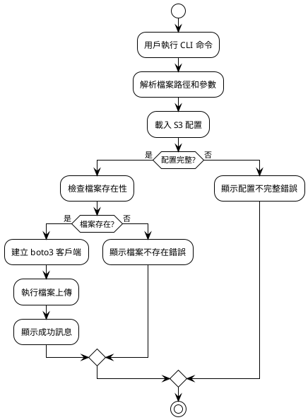
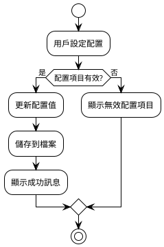

# 檔案上傳功能處理流程設計

## 1. 簡化流程概觀



## 2. 配置管理流程



## 3. CLI 命令結構設計

### 3.1 配置命令
```bash
# 設定 AWS 認證資訊
cloud-storage-syncer config set access-key YOUR_ACCESS_KEY
cloud-storage-syncer config set secret-key YOUR_SECRET_KEY
cloud-storage-syncer config set bucket YOUR_BUCKET_NAME
cloud-storage-syncer config set region us-west-2

# 查看當前配置
cloud-storage-syncer config show

# 測試配置
cloud-storage-syncer config test
```

### 3.2 上傳命令
```bash
# 基本上傳 (使用預設 Intelligent-Tiering)
cloud-storage-syncer upload /path/to/file.txt

# 指定 Storage Class
cloud-storage-syncer upload /path/to/file.txt --storage-class STANDARD

# 指定 S3 中的檔名
cloud-storage-syncer upload /path/to/file.txt --key my-folder/renamed-file.txt
```

## 4. 基本錯誤處理

簡單的錯誤處理策略：
- 檔案不存在 → 顯示錯誤訊息
- 配置不完整 → 提示設定配置
- S3 操作失敗 → 顯示 boto3 原始錯誤
- 網路問題 → 顯示連接錯誤
