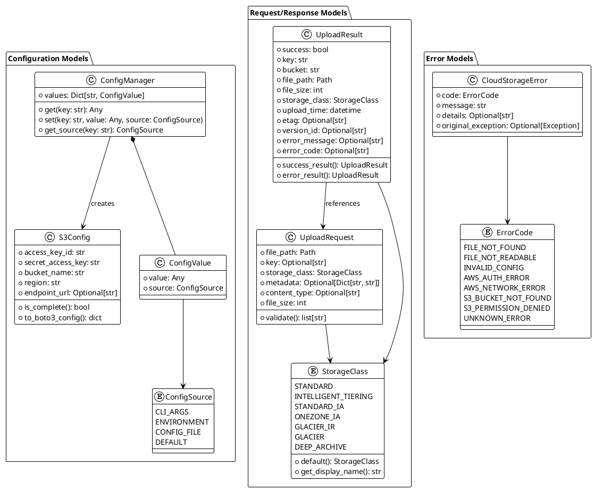
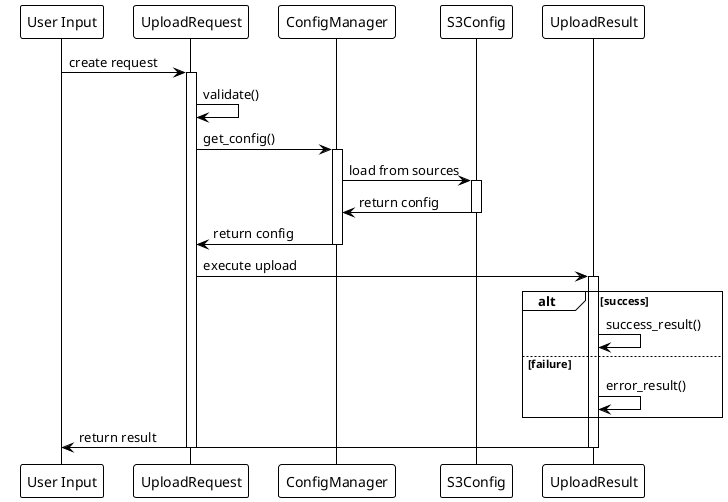

# 資料模型設計

## 1. 抽象資料模型架構

### 1.1 資料模型關係圖



### 1.2 資料流向圖



## 2. 具體資料模型實作

### 2.1 S3 配置模型 (S3Config)

```python
from typing import Optional
from enum import Enum
from dataclasses import dataclass

@dataclass
class S3Config:
    """S3 連接配置資料模型"""
    access_key_id: str
    secret_access_key: str
    bucket_name: str
    region: str = "us-east-1"
    endpoint_url: Optional[str] = None  # 支援 LocalStack 等測試環境

    def is_complete(self) -> bool:
        """檢查配置是否完整"""
        return bool(
            self.access_key_id and
            self.secret_access_key and
            self.bucket_name
        )

    def to_boto3_config(self) -> dict:
        """轉換為 boto3 客戶端配置"""
        config = {
            'aws_access_key_id': self.access_key_id,
            'aws_secret_access_key': self.secret_access_key,
            'region_name': self.region,
        }
        if self.endpoint_url:
            config['endpoint_url'] = self.endpoint_url
        return config
```

### 2.2 Storage Class 枚舉

```python
class StorageClass(str, Enum):
    """S3 儲存等級枚舉"""
    STANDARD = "STANDARD"
    INTELLIGENT_TIERING = "INTELLIGENT_TIERING"
    STANDARD_IA = "STANDARD_IA"
    ONEZONE_IA = "ONEZONE_IA"
    GLACIER_IR = "GLACIER_IR"  # Instant Retrieval
    GLACIER = "GLACIER"        # Flexible Retrieval
    DEEP_ARCHIVE = "DEEP_ARCHIVE"

    @classmethod
    def default(cls) -> 'StorageClass':
        """預設儲存等級"""
        return cls.INTELLIGENT_TIERING

    @classmethod
    def get_display_name(cls, storage_class: 'StorageClass') -> str:
        """取得顯示名稱"""
        display_names = {
            cls.STANDARD: "Standard",
            cls.INTELLIGENT_TIERING: "Intelligent-Tiering",
            cls.STANDARD_IA: "Standard-IA (Infrequent Access)",
            cls.ONEZONE_IA: "One Zone-IA",
            cls.GLACIER_IR: "Glacier Instant Retrieval",
            cls.GLACIER: "Glacier Flexible Retrieval",
            cls.DEEP_ARCHIVE: "Glacier Deep Archive"
        }
        return display_names.get(storage_class, storage_class.value)
```

### 2.3 上傳請求模型 (UploadRequest)

```python
from pathlib import Path
from typing import Optional, Dict, Any

@dataclass
class UploadRequest:
    """檔案上傳請求資料模型"""
    file_path: Path
    key: Optional[str] = None  # S3 中的檔名，None 則使用原檔名
    storage_class: StorageClass = StorageClass.default()
    metadata: Optional[Dict[str, str]] = None
    content_type: Optional[str] = None

    def __post_init__(self):
        """初始化後處理"""
        # 確保 file_path 是 Path 物件
        if isinstance(self.file_path, str):
            self.file_path = Path(self.file_path)

        # 如果沒有指定 key，使用檔案名稱
        if self.key is None:
            self.key = self.file_path.name

    def validate(self) -> list[str]:
        """驗證請求資料，回傳錯誤訊息列表"""
        errors = []

        if not self.file_path.exists():
            errors.append(f"檔案不存在: {self.file_path}")

        if not self.file_path.is_file():
            errors.append(f"路徑不是檔案: {self.file_path}")

        if not self.file_path.stat().st_size > 0:
            errors.append(f"檔案為空: {self.file_path}")

        if not self.key or not self.key.strip():
            errors.append("S3 key 不能為空")

        return errors

    @property
    def file_size(self) -> int:
        """取得檔案大小"""
        return self.file_path.stat().st_size if self.file_path.exists() else 0
```

### 2.4 上傳結果模型 (UploadResult)

```python
from datetime import datetime
from typing import Optional

@dataclass
class UploadResult:
    """檔案上傳結果資料模型"""
    success: bool
    key: str
    bucket: str
    file_path: Path
    file_size: int
    storage_class: StorageClass
    upload_time: datetime
    etag: Optional[str] = None
    version_id: Optional[str] = None
    error_message: Optional[str] = None
    error_code: Optional[str] = None

    @classmethod
    def success_result(
        cls,
        key: str,
        bucket: str,
        file_path: Path,
        file_size: int,
        storage_class: StorageClass,
        etag: Optional[str] = None,
        version_id: Optional[str] = None
    ) -> 'UploadResult':
        """建立成功結果"""
        return cls(
            success=True,
            key=key,
            bucket=bucket,
            file_path=file_path,
            file_size=file_size,
            storage_class=storage_class,
            upload_time=datetime.now(),
            etag=etag,
            version_id=version_id
        )

    @classmethod
    def error_result(
        cls,
        key: str,
        bucket: str,
        file_path: Path,
        file_size: int,
        storage_class: StorageClass,
        error_message: str,
        error_code: Optional[str] = None
    ) -> 'UploadResult':
        """建立錯誤結果"""
        return cls(
            success=False,
            key=key,
            bucket=bucket,
            file_path=file_path,
            file_size=file_size,
            storage_class=storage_class,
            upload_time=datetime.now(),
            error_message=error_message,
            error_code=error_code
        )
```

### 2.5 配置資料來源模型

```python
from typing import Union, Dict, Any

class ConfigSource(str, Enum):
    """配置資料來源"""
    CLI_ARGS = "cli_args"
    ENVIRONMENT = "environment"
    CONFIG_FILE = "config_file"
    DEFAULT = "default"

@dataclass
class ConfigValue:
    """配置值與來源"""
    value: Any
    source: ConfigSource

    def __str__(self) -> str:
        return str(self.value)

@dataclass
class ConfigManager:
    """配置管理器資料模型"""
    values: Dict[str, ConfigValue]

    def get(self, key: str) -> Optional[Any]:
        """取得配置值"""
        config_value = self.values.get(key)
        return config_value.value if config_value else None

    def set(self, key: str, value: Any, source: ConfigSource) -> None:
        """設定配置值"""
        self.values[key] = ConfigValue(value=value, source=source)

    def get_source(self, key: str) -> Optional[ConfigSource]:
        """取得配置來源"""
        config_value = self.values.get(key)
        return config_value.source if config_value else None
```

## 3. 資料驗證與轉換規則

### 3.1 S3Config 驗證
- `access_key_id`: 非空字串，20字元 AWS Access Key ID 格式
- `secret_access_key`: 非空字串，40字元 AWS Secret Access Key 格式
- `bucket_name`: 符合 S3 bucket 命名規則
- `region`: 有效的 AWS 區域代碼

### 3.2 UploadRequest 驗證
- `file_path`: 檔案必須存在且可讀取
- `key`: 符合 S3 物件 key 命名規則
- `storage_class`: 必須是有效的 StorageClass 枚舉值
- `file_size`: 不超過 S3 單一檔案大小限制 (5TB)

### 3.3 資料轉換規則
- 檔案路徑自動轉換為 Path 物件
- Storage Class 字串自動轉換為枚舉
- 時間戳記使用 UTC 時區
- 檔案大小以 bytes 為單位

## 4. 錯誤處理資料模型

```python
from enum import Enum
from typing import Optional

class ErrorCode(str, Enum):
    """錯誤代碼枚舉"""
    FILE_NOT_FOUND = "FILE_NOT_FOUND"
    FILE_NOT_READABLE = "FILE_NOT_READABLE"
    INVALID_CONFIG = "INVALID_CONFIG"
    AWS_AUTH_ERROR = "AWS_AUTH_ERROR"
    AWS_NETWORK_ERROR = "AWS_NETWORK_ERROR"
    S3_BUCKET_NOT_FOUND = "S3_BUCKET_NOT_FOUND"
    S3_PERMISSION_DENIED = "S3_PERMISSION_DENIED"
    UNKNOWN_ERROR = "UNKNOWN_ERROR"

@dataclass
class CloudStorageError(Exception):
    """雲端儲存錯誤"""
    code: ErrorCode
    message: str
    details: Optional[str] = None
    original_exception: Optional[Exception] = None

    def __str__(self) -> str:
        return f"[{self.code.value}] {self.message}"
```

這些資料模型設計遵循以下原則：
- **類型安全**: 使用 type hints 和 dataclass
- **驗證完整**: 提供完整的資料驗證方法
- **擴展性**: 易於添加新欄位和方法
- **可讀性**: 清晰的命名和文檔
- **SOLID 原則**: 單一職責、開放封閉原則
