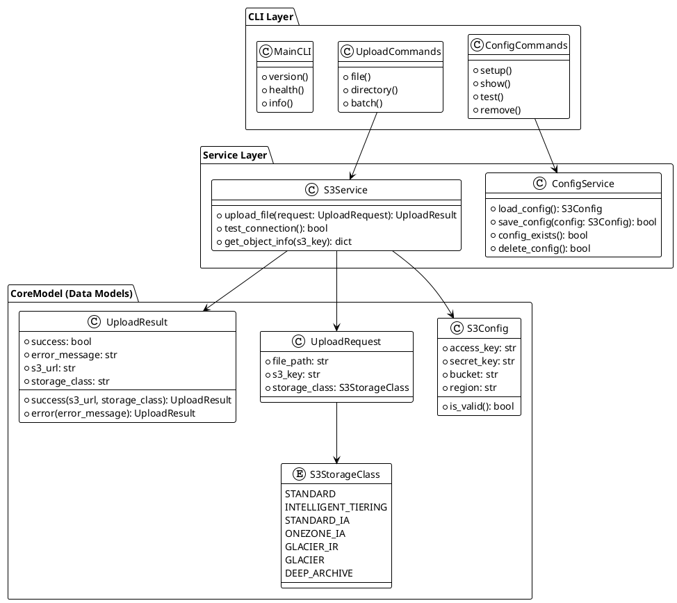
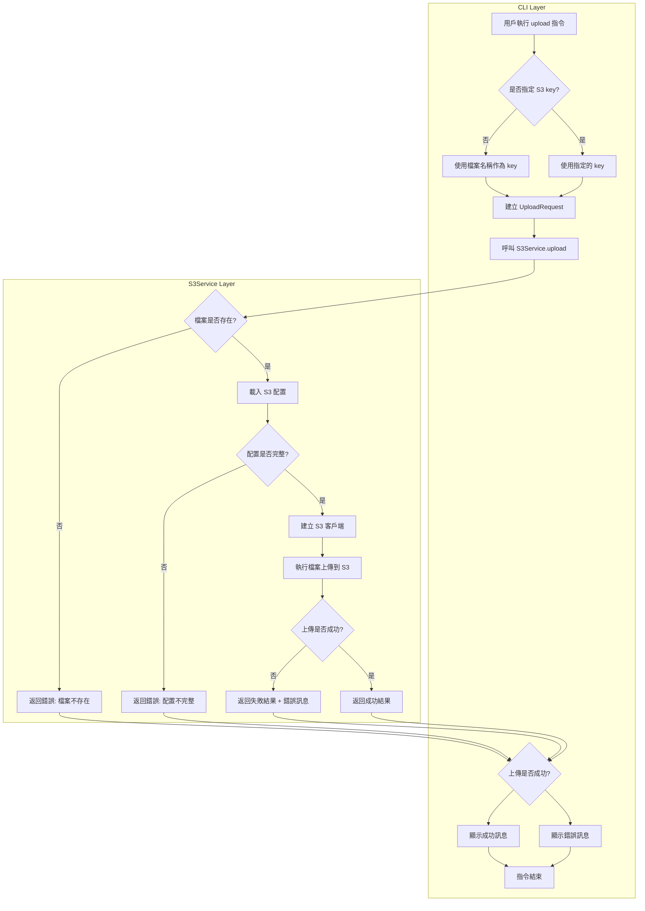
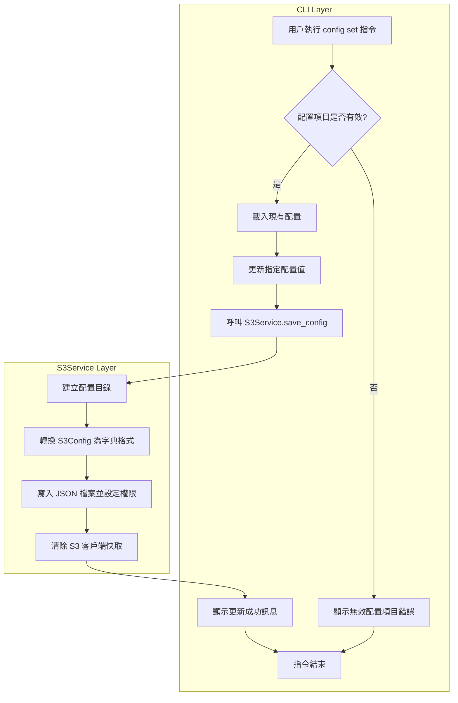
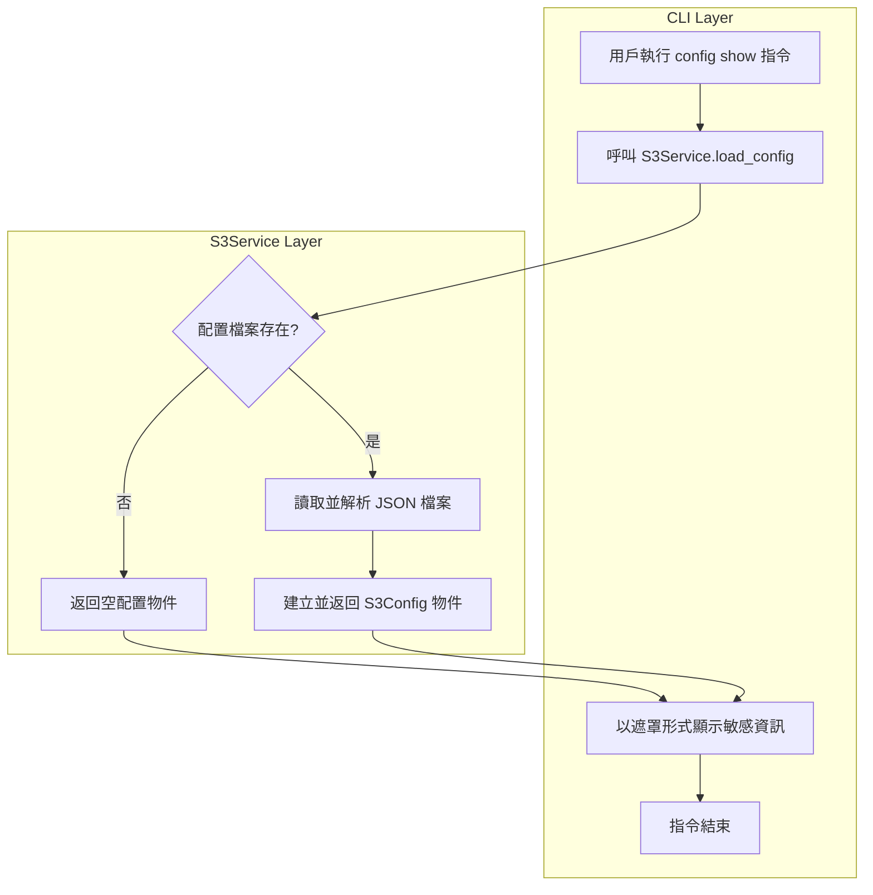
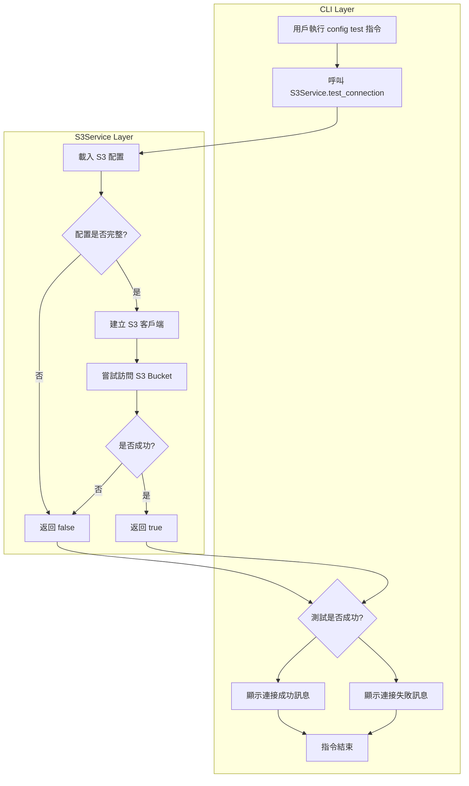
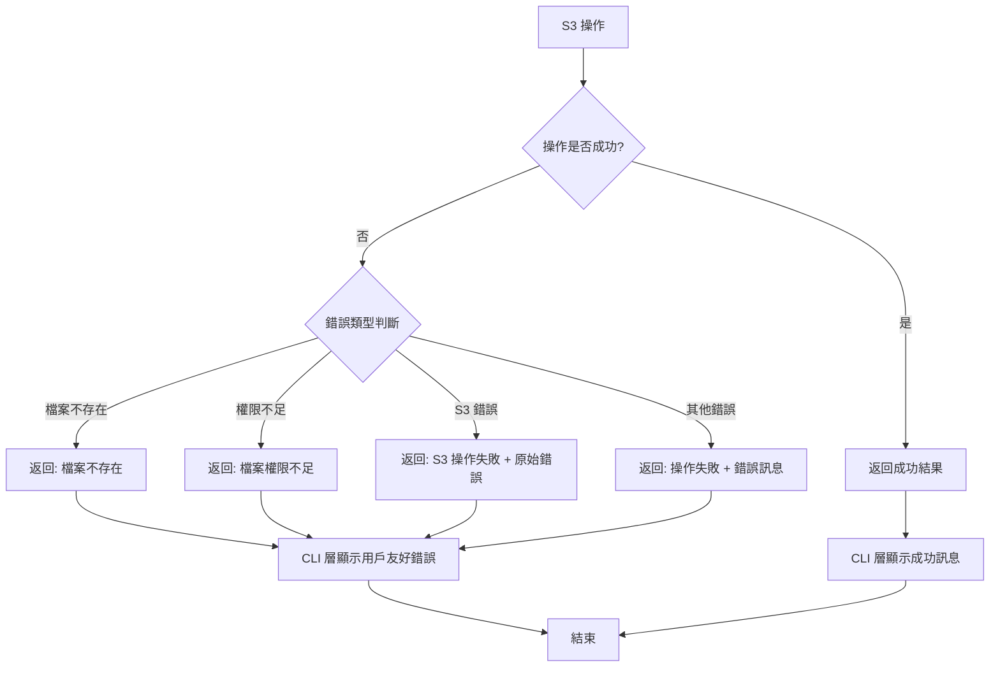
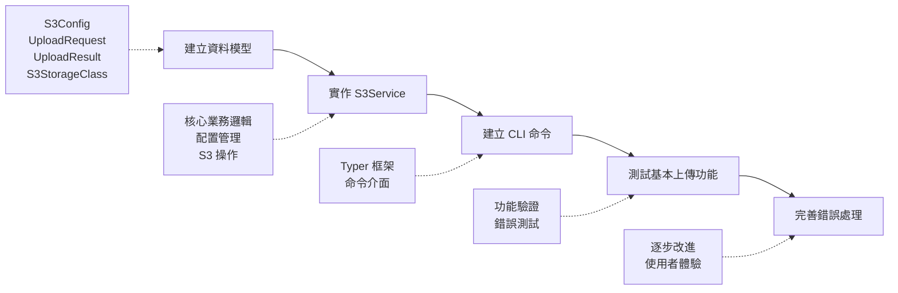

# 類別介面設計

## 1. 類別架構設計

### 1.1 整體架構概觀

## 2. CLI 指令與流程設計

### 2.1 CLI 指令清單

本系統將提供以下 CLI 指令：

1. **主要功能指令**
   - `upload` - 上傳檔案到 S3

2. **配置管理指令群組 (config)**
   - `config set` - 設定配置項目
   - `config show` - 顯示目前配置
   - `config test` - 測試 S3 連接

### 2.2 upload 指令完整流程

### 2.3 config set 指令完整流程

### 2.4 config show 指令完整流程

### 2.5 config test 指令完整流程

## 3. 錯誤處理策略

### 3.1 錯誤處理流程

### 3.2 常見錯誤場景處理

- **檔案不存在** → 顯示錯誤訊息
- **配置不完整** → 提示設定配置
- **S3 操作失敗** → 顯示 boto3 原始錯誤
- **網路問題** → 顯示連接錯誤

## 4. 實作步驟

### 4.1 開發階段規劃

### 4.2 設計優勢

此設計清楚分離：
- **CoreModel**: 純資料結構，提供型別安全
- **Service**: 業務邏輯處理，具有清晰介面
- **CLI**: 使用者介面，委派給服務層處理

這種方法避免過度工程化，同時保持乾淨、易維護的結構，專注於核心需求：「簡單檔案上傳功能」。
