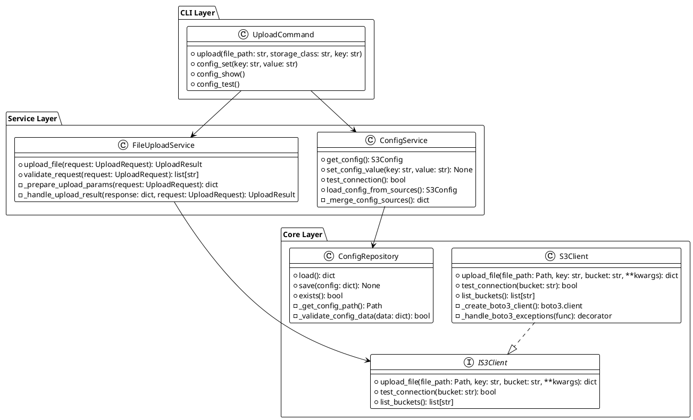

# Class/Method/Interface 設計

## 1. 整體架構設計

### 1.1 三層架構概觀



## 2. CLI Layer 詳細設計

### 2.1 UploadCommand 類別

```python
from typing import Optional
import typer
from pathlib import Path

class UploadCommand:
    """檔案上傳 CLI 命令處理器"""

    def __init__(self, upload_service: FileUploadService, config_service: ConfigService):
        self.upload_service = upload_service
        self.config_service = config_service

    def upload(
        self,
        file_path: str,
        storage_class: str = StorageClass.INTELLIGENT_TIERING.value,
        key: Optional[str] = None,
        show_progress: bool = True
    ) -> None:
        """
        上傳檔案到 S3

        Args:
            file_path: 要上傳的檔案路徑
            storage_class: S3 儲存等級
            key: S3 中的檔名 (可選)
            show_progress: 是否顯示進度條
        """
        try:
            # 建立上傳請求
            request = UploadRequest(
                file_path=Path(file_path),
                key=key,
                storage_class=StorageClass(storage_class)
            )

            # 驗證請求
            errors = self.upload_service.validate_request(request)
            if errors:
                for error in errors:
                    typer.echo(f"❌ {error}", err=True)
                raise typer.Exit(1)

            # 執行上傳
            with typer.progressbar(length=request.file_size, label="上傳中...") as progress:
                result = self.upload_service.upload_file(request, progress_callback=progress.update)

            # 顯示結果
            if result.success:
                typer.echo(f"✅ 檔案上傳成功")
                typer.echo(f"   檔案: {result.file_path.name}")
                typer.echo(f"   S3 Key: {result.key}")
                typer.echo(f"   Bucket: {result.bucket}")
                typer.echo(f"   Storage Class: {StorageClass.get_display_name(result.storage_class)}")
                typer.echo(f"   檔案大小: {self._format_file_size(result.file_size)}")
            else:
                typer.echo(f"❌ 上傳失敗: {result.error_message}", err=True)
                raise typer.Exit(1)

        except StorageClass as e:
            typer.echo(f"❌ 無效的儲存等級: {storage_class}", err=True)
            self._show_available_storage_classes()
            raise typer.Exit(1)
        except Exception as e:
            typer.echo(f"❌ 上傳過程發生錯誤: {str(e)}", err=True)
            raise typer.Exit(1)

    def config_set(self, key: str, value: str) -> None:
        """設定配置值"""
        try:
            self.config_service.set_config_value(key, value)
            typer.echo(f"✅ 配置已更新: {key}")
        except ValueError as e:
            typer.echo(f"❌ 配置錯誤: {str(e)}", err=True)
            raise typer.Exit(1)

    def config_show(self) -> None:
        """顯示當前配置"""
        try:
            config = self.config_service.get_config()
            typer.echo("🔧 當前 S3 配置:")
            typer.echo(f"   Access Key ID: {self._mask_sensitive(config.access_key_id)}")
            typer.echo(f"   Secret Access Key: {self._mask_sensitive(config.secret_access_key)}")
            typer.echo(f"   Bucket Name: {config.bucket_name}")
            typer.echo(f"   Region: {config.region}")

            if not config.is_complete():
                typer.echo("⚠️  配置不完整，請使用 'config set' 命令設定缺少的項目", err=True)
        except Exception as e:
            typer.echo(f"❌ 無法載入配置: {str(e)}", err=True)
            raise typer.Exit(1)

    def config_test(self) -> None:
        """測試 S3 連接"""
        try:
            typer.echo("🔍 測試 S3 連接...")
            if self.config_service.test_connection():
                typer.echo("✅ S3 連接測試成功")
            else:
                typer.echo("❌ S3 連接測試失敗", err=True)
                raise typer.Exit(1)
        except Exception as e:
            typer.echo(f"❌ 連接測試錯誤: {str(e)}", err=True)
            raise typer.Exit(1)

    def _mask_sensitive(self, value: str) -> str:
        """遮罩敏感資訊"""
        if not value or len(value) < 8:
            return "****"
        return f"{value[:4]}****{value[-4:]}"

    def _format_file_size(self, size_bytes: int) -> str:
        """格式化檔案大小"""
        for unit in ['B', 'KB', 'MB', 'GB', 'TB']:
            if size_bytes < 1024.0:
                return f"{size_bytes:.1f} {unit}"
            size_bytes /= 1024.0
        return f"{size_bytes:.1f} PB"

    def _show_available_storage_classes(self) -> None:
        """顯示可用的儲存等級"""
        typer.echo("可用的儲存等級:")
        for storage_class in StorageClass:
            display_name = StorageClass.get_display_name(storage_class)
            typer.echo(f"  - {storage_class.value}: {display_name}")
```

### 2.2 CLI 應用程式整合

```python
# 在現有的 cli/main.py 中添加新命令

@app.group()
def upload():
    """檔案上傳相關命令"""
    pass

@app.group()
def config():
    """配置管理相關命令"""
    pass

# 依賴注入設定
def get_upload_command() -> UploadCommand:
    """取得上傳命令處理器"""
    config_repo = ConfigRepository()
    s3_client = S3Client()
    config_service = ConfigService(config_repo)
    upload_service = FileUploadService(s3_client, config_service)
    return UploadCommand(upload_service, config_service)

@upload.command("file")
def upload_file(
    file_path: str = typer.Argument(..., help="要上傳的檔案路徑"),
    storage_class: str = typer.Option(
        StorageClass.INTELLIGENT_TIERING.value,
        "--storage-class", "-s",
        help="S3 儲存等級"
    ),
    key: Optional[str] = typer.Option(None, "--key", "-k", help="S3 中的檔名"),
) -> None:
    """上傳檔案到 S3"""
    upload_cmd = get_upload_command()
    upload_cmd.upload(file_path, storage_class, key)

@config.command("set")
def config_set(
    key: str = typer.Argument(..., help="配置項目名稱"),
    value: str = typer.Argument(..., help="配置值"),
) -> None:
    """設定配置值"""
    upload_cmd = get_upload_command()
    upload_cmd.config_set(key, value)

@config.command("show")
def config_show() -> None:
    """顯示當前配置"""
    upload_cmd = get_upload_command()
    upload_cmd.config_show()

@config.command("test")
def config_test() -> None:
    """測試 S3 連接"""
    upload_cmd = get_upload_command()
    upload_cmd.config_test()
```

## 3. Service Layer 詳細設計

### 3.1 FileUploadService 類別

```python
from typing import Optional, Callable
import mimetypes
from pathlib import Path

class FileUploadService:
    """檔案上傳服務"""

    def __init__(self, s3_client: IS3Client, config_service: ConfigService):
        self.s3_client = s3_client
        self.config_service = config_service

    def upload_file(
        self,
        request: UploadRequest,
        progress_callback: Optional[Callable[[int], None]] = None
    ) -> UploadResult:
        """
        上傳檔案到 S3

        Args:
            request: 上傳請求
            progress_callback: 進度回調函數

        Returns:
            上傳結果
        """
        try:
            # 驗證請求
            errors = self.validate_request(request)
            if errors:
                raise ValueError(f"請求驗證失敗: {'; '.join(errors)}")

            # 載入配置
            config = self.config_service.get_config()
            if not config.is_complete():
                raise ValueError("S3 配置不完整")

            # 準備上傳參數
            upload_params = self._prepare_upload_params(request)

            # 執行上傳
            response = self.s3_client.upload_file(
                file_path=request.file_path,
                key=request.key,
                bucket=config.bucket_name,
                progress_callback=progress_callback,
                **upload_params
            )

            # 處理結果
            return self._handle_upload_result(response, request, config)

        except Exception as e:
            return UploadResult.error_result(
                key=request.key,
                bucket=config.bucket_name if config else "unknown",
                file_path=request.file_path,
                file_size=request.file_size,
                storage_class=request.storage_class,
                error_message=str(e),
                error_code=self._get_error_code(e)
            )

    def validate_request(self, request: UploadRequest) -> list[str]:
        """驗證上傳請求"""
        errors = request.validate()

        # 額外的業務邏輯驗證
        if request.file_size > 5 * 1024 * 1024 * 1024 * 1024:  # 5TB
            errors.append("檔案大小超過 S3 限制 (5TB)")

        return errors

    def _prepare_upload_params(self, request: UploadRequest) -> dict:
        """準備上傳參數"""
        params = {
            'StorageClass': request.storage_class.value
        }

        # 自動偵測 Content Type
        if request.content_type is None:
            content_type, _ = mimetypes.guess_type(str(request.file_path))
            if content_type:
                params['ContentType'] = content_type
        else:
            params['ContentType'] = request.content_type

        # 添加 Metadata
        if request.metadata:
            params['Metadata'] = request.metadata

        return params

    def _handle_upload_result(
        self,
        response: dict,
        request: UploadRequest,
        config: S3Config
    ) -> UploadResult:
        """處理上傳結果"""
        return UploadResult.success_result(
            key=request.key,
            bucket=config.bucket_name,
            file_path=request.file_path,
            file_size=request.file_size,
            storage_class=request.storage_class,
            etag=response.get('ETag'),
            version_id=response.get('VersionId')
        )

    def _get_error_code(self, exception: Exception) -> Optional[str]:
        """取得錯誤代碼"""
        if isinstance(exception, FileNotFoundError):
            return ErrorCode.FILE_NOT_FOUND.value
        elif isinstance(exception, PermissionError):
            return ErrorCode.FILE_NOT_READABLE.value
        # 更多錯誤碼對應...
        return ErrorCode.UNKNOWN_ERROR.value
```

### 3.2 ConfigService 類別

```python
import os
from typing import Dict, Any

class ConfigService:
    """配置管理服務"""

    def __init__(self, config_repository: ConfigRepository):
        self.config_repository = config_repository
        self._config_cache: Optional[S3Config] = None

    def get_config(self) -> S3Config:
        """取得 S3 配置"""
        if self._config_cache is None:
            self._config_cache = self.load_config_from_sources()
        return self._config_cache

    def set_config_value(self, key: str, value: str) -> None:
        """設定配置值"""
        # 驗證配置鍵值
        valid_keys = {
            'aws-access-key-id': 'access_key_id',
            'aws-secret-access-key': 'secret_access_key',
            'bucket-name': 'bucket_name',
            'region': 'region'
        }

        if key not in valid_keys:
            raise ValueError(f"無效的配置項目: {key}")

        # 載入現有配置
        current_config = self.config_repository.load()

        # 更新配置
        current_config[valid_keys[key]] = value

        # 儲存配置
        self.config_repository.save(current_config)

        # 清除快取
        self._config_cache = None

    def test_connection(self) -> bool:
        """測試 S3 連接"""
        try:
            config = self.get_config()
            if not config.is_complete():
                return False

            # 這裡需要 S3Client 實例來測試連接
            # 為了避免循環依賴，可以在初始化時注入
            s3_client = S3Client()
            s3_client.configure(config)
            return s3_client.test_connection(config.bucket_name)

        except Exception:
            return False

    def load_config_from_sources(self) -> S3Config:
        """從各種來源載入配置"""
        config_data = self._merge_config_sources()

        return S3Config(
            access_key_id=config_data.get('access_key_id', ''),
            secret_access_key=config_data.get('secret_access_key', ''),
            bucket_name=config_data.get('bucket_name', ''),
            region=config_data.get('region', 'us-east-1')
        )

    def _merge_config_sources(self) -> Dict[str, Any]:
        """合併各種配置來源"""
        config = {}

        # 1. 預設值
        defaults = {
            'region': 'us-east-1'
        }
        config.update(defaults)

        # 2. 配置檔案
        try:
            file_config = self.config_repository.load()
            config.update(file_config)
        except Exception:
            pass  # 配置檔案不存在或損壞

        # 3. 環境變數
        env_mapping = {
            'AWS_ACCESS_KEY_ID': 'access_key_id',
            'AWS_SECRET_ACCESS_KEY': 'secret_access_key',
            'AWS_DEFAULT_REGION': 'region',
            'S3_BUCKET_NAME': 'bucket_name'
        }

        for env_key, config_key in env_mapping.items():
            env_value = os.getenv(env_key)
            if env_value:
                config[config_key] = env_value

        return config
```

## 4. Core Layer 詳細設計

### 4.1 IS3Client 介面

```python
from abc import ABC, abstractmethod
from typing import Dict, Any, List, Optional, Callable
from pathlib import Path

class IS3Client(ABC):
    """S3 客戶端介面"""

    @abstractmethod
    def configure(self, config: S3Config) -> None:
        """配置 S3 客戶端"""
        pass

    @abstractmethod
    def upload_file(
        self,
        file_path: Path,
        key: str,
        bucket: str,
        progress_callback: Optional[Callable[[int], None]] = None,
        **kwargs
    ) -> Dict[str, Any]:
        """上傳檔案到 S3"""
        pass

    @abstractmethod
    def test_connection(self, bucket: str) -> bool:
        """測試 S3 連接"""
        pass

    @abstractmethod
    def list_buckets(self) -> List[str]:
        """列出所有 buckets"""
        pass
```

### 4.2 S3Client 實作

```python
import boto3
from botocore.exceptions import ClientError, NoCredentialsError
from functools import wraps
from typing import Dict, Any, List, Optional, Callable

class S3Client(IS3Client):
    """S3 客戶端實作"""

    def __init__(self):
        self._client: Optional[boto3.client] = None
        self._config: Optional[S3Config] = None

    def configure(self, config: S3Config) -> None:
        """配置 S3 客戶端"""
        self._config = config
        self._client = self._create_boto3_client()

    @_handle_boto3_exceptions
    def upload_file(
        self,
        file_path: Path,
        key: str,
        bucket: str,
        progress_callback: Optional[Callable[[int], None]] = None,
        **kwargs
    ) -> Dict[str, Any]:
        """上傳檔案到 S3"""
        if not self._client:
            raise ValueError("S3 客戶端未配置")

        # 準備上傳參數
        extra_args = {k: v for k, v in kwargs.items() if v is not None}

        # 如果有進度回調，使用 upload_file，否則使用 put_object
        if progress_callback:
            self._client.upload_file(
                str(file_path),
                bucket,
                key,
                ExtraArgs=extra_args,
                Callback=progress_callback
            )
            # upload_file 不返回 response，需要用 head_object 取得資訊
            response = self._client.head_object(Bucket=bucket, Key=key)
        else:
            with open(file_path, 'rb') as file_obj:
                response = self._client.put_object(
                    Bucket=bucket,
                    Key=key,
                    Body=file_obj,
                    **extra_args
                )

        return response

    @_handle_boto3_exceptions
    def test_connection(self, bucket: str) -> bool:
        """測試 S3 連接"""
        if not self._client:
            return False

        try:
            self._client.head_bucket(Bucket=bucket)
            return True
        except ClientError as e:
            error_code = e.response['Error']['Code']
            if error_code == '404':
                # Bucket 不存在
                return False
            elif error_code == '403':
                # 沒有權限但可以連接
                return True
            else:
                return False

    @_handle_boto3_exceptions
    def list_buckets(self) -> List[str]:
        """列出所有 buckets"""
        if not self._client:
            raise ValueError("S3 客戶端未配置")

        response = self._client.list_buckets()
        return [bucket['Name'] for bucket in response['Buckets']]

    def _create_boto3_client(self) -> boto3.client:
        """建立 boto3 客戶端"""
        if not self._config:
            raise ValueError("配置未設定")

        boto3_config = self._config.to_boto3_config()
        return boto3.client('s3', **boto3_config)

    @staticmethod
    def _handle_boto3_exceptions(func):
        """處理 boto3 異常的裝飾器"""
        @wraps(func)
        def wrapper(*args, **kwargs):
            try:
                return func(*args, **kwargs)
            except NoCredentialsError as e:
                raise CloudStorageError(
                    code=ErrorCode.AWS_AUTH_ERROR,
                    message="AWS 認證失敗",
                    details="請檢查 Access Key 和 Secret Key",
                    original_exception=e
                )
            except ClientError as e:
                error_code = e.response['Error']['Code']
                error_message = e.response['Error']['Message']

                if error_code == 'NoSuchBucket':
                    raise CloudStorageError(
                        code=ErrorCode.S3_BUCKET_NOT_FOUND,
                        message=f"S3 Bucket 不存在: {error_message}",
                        original_exception=e
                    )
                elif error_code == 'AccessDenied':
                    raise CloudStorageError(
                        code=ErrorCode.S3_PERMISSION_DENIED,
                        message=f"S3 權限不足: {error_message}",
                        original_exception=e
                    )
                else:
                    raise CloudStorageError(
                        code=ErrorCode.UNKNOWN_ERROR,
                        message=f"S3 操作失敗: {error_message}",
                        details=f"錯誤代碼: {error_code}",
                        original_exception=e
                    )
            except Exception as e:
                raise CloudStorageError(
                    code=ErrorCode.UNKNOWN_ERROR,
                    message="未知錯誤",
                    details=str(e),
                    original_exception=e
                )
        return wrapper
```

### 4.3 ConfigRepository 類別

```python
import json
from pathlib import Path
from typing import Dict, Any

class ConfigRepository:
    """配置存儲庫"""

    def __init__(self, config_dir: Optional[Path] = None):
        self.config_dir = config_dir or Path.home() / '.cloud-storage-syncer'
        self.config_file = self.config_dir / 'config.json'

    def load(self) -> Dict[str, Any]:
        """載入配置"""
        if not self.exists():
            return {}

        try:
            with open(self.config_file, 'r', encoding='utf-8') as f:
                data = json.load(f)
                if self._validate_config_data(data):
                    return data
                else:
                    return {}
        except (json.JSONDecodeError, IOError):
            return {}

    def save(self, config: Dict[str, Any]) -> None:
        """儲存配置"""
        # 確保配置目錄存在
        self.config_dir.mkdir(parents=True, exist_ok=True)

        # 驗證配置資料
        if not self._validate_config_data(config):
            raise ValueError("配置資料格式無效")

        # 儲存到檔案
        with open(self.config_file, 'w', encoding='utf-8') as f:
            json.dump(config, f, indent=2, ensure_ascii=False)

        # 設定檔案權限 (只有擁有者可讀寫)
        self.config_file.chmod(0o600)

    def exists(self) -> bool:
        """檢查配置檔案是否存在"""
        return self.config_file.exists()

    def _get_config_path(self) -> Path:
        """取得配置檔案路徑"""
        return self.config_file

    def _validate_config_data(self, data: Dict[str, Any]) -> bool:
        """驗證配置資料格式"""
        if not isinstance(data, dict):
            return False

        # 檢查必要欄位類型
        string_fields = ['access_key_id', 'secret_access_key', 'bucket_name', 'region']
        for field in string_fields:
            if field in data and not isinstance(data[field], str):
                return False

        return True
```

## 5. 依賴注入與組裝

```python
# di.py - 依賴注入配置

class DIContainer:
    """依賴注入容器"""

    def __init__(self):
        self._instances = {}

    def get_config_repository(self) -> ConfigRepository:
        """取得配置存儲庫"""
        if 'config_repository' not in self._instances:
            self._instances['config_repository'] = ConfigRepository()
        return self._instances['config_repository']

    def get_s3_client(self) -> IS3Client:
        """取得 S3 客戶端"""
        if 's3_client' not in self._instances:
            self._instances['s3_client'] = S3Client()
        return self._instances['s3_client']

    def get_config_service(self) -> ConfigService:
        """取得配置服務"""
        if 'config_service' not in self._instances:
            config_repo = self.get_config_repository()
            self._instances['config_service'] = ConfigService(config_repo)
        return self._instances['config_service']

    def get_upload_service(self) -> FileUploadService:
        """取得上傳服務"""
        if 'upload_service' not in self._instances:
            s3_client = self.get_s3_client()
            config_service = self.get_config_service()

            # 配置 S3 客戶端
            config = config_service.get_config()
            if config.is_complete():
                s3_client.configure(config)

            self._instances['upload_service'] = FileUploadService(s3_client, config_service)
        return self._instances['upload_service']

    def get_upload_command(self) -> UploadCommand:
        """取得上傳命令處理器"""
        if 'upload_command' not in self._instances:
            upload_service = self.get_upload_service()
            config_service = self.get_config_service()
            self._instances['upload_command'] = UploadCommand(upload_service, config_service)
        return self._instances['upload_command']

# 全域容器實例
container = DIContainer()
```

這個設計遵循了 SOLID 原則：
- **S**: 每個類別都有單一職責
- **O**: 使用介面設計，易於擴展
- **L**: 實作類別可以替換介面
- **I**: 介面分離，不同層級有不同介面
- **D**: 依賴抽象而非具體實作

設計特色：
- **三層架構**: 清晰的責任分離
- **介面驅動**: 易於測試和擴展
- **錯誤處理**: 完整的異常處理機制
- **配置管理**: 多來源配置合併
- **進度顯示**: 支援檔案上傳進度
