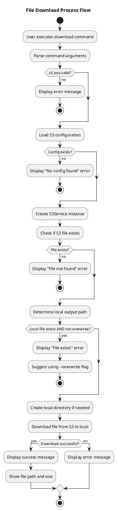
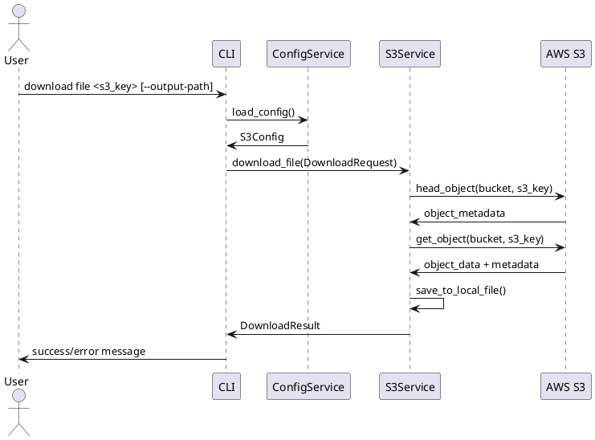
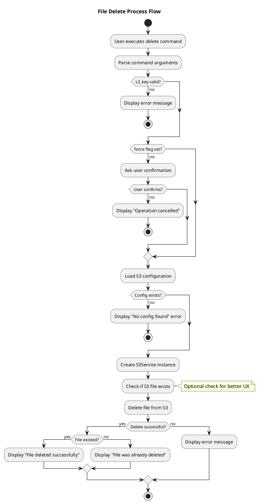
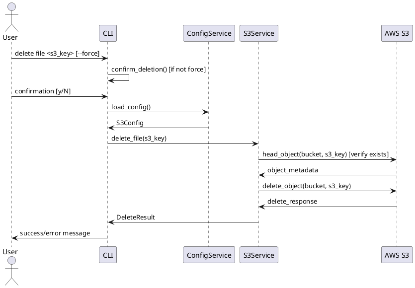

# Download and Delete Feature Process Flow Design

## 概要
在既有的檔案上傳和列表功能基礎上，新增檔案下載和刪除功能。這兩個功能將遵循既有的分層架構設計，確保與現有系統的一致性和未來 Web UI 擴充的相容性。

## 1. 檔案下載處理流程

### 1.1 下載功能流程圖


### 1.2 下載時序圖


### 1.2 下載處理步驟
1. **參數驗證**: 驗證 s3_key 參數，檢查輸出路徑（如有指定）
2. **配置載入**: 載入 S3 配置檔案
3. **S3 連線**: 建立與 S3 的連線
4. **檔案存在檢查**: 檢查 S3 上是否存在指定的檔案
5. **本地路徑處理**:
   - 如果指定了輸出路徑，使用指定路徑
   - 如果未指定，使用 S3 key 的檔案名稱儲存在當前目錄
6. **檔案下載**: 從 S3 下載檔案到本地
7. **結果回報**: 回報下載成功或失敗

## 2. 檔案刪除處理流程

### 2.1 刪除功能流程圖


### 2.2 刪除時序圖


### 2.2 刪除處理步驟
1. **參數驗證**: 驗證 s3_key 參數
2. **確認對話**: 如果未使用 `--force` 選項，要求使用者確認刪除
3. **配置載入**: 載入 S3 配置檔案
4. **S3 連線**: 建立與 S3 的連線
5. **檔案存在檢查**: 檢查 S3 上是否存在指定的檔案
6. **檔案刪除**: 從 S3 刪除指定檔案
7. **結果回報**: 回報刪除成功或失敗

## 3. CLI Command Structure Design

### 3.1 Download Commands
```bash
# Download file to current directory with original filename
cloud-storage-syncer download file <s3_key>

# Download file to specified path
cloud-storage-syncer download file <s3_key> --output-path /local/path/filename.ext

# Download file to specified directory (keep original filename)
cloud-storage-syncer download file <s3_key> --output-dir /local/directory/
```

### 3.2 Delete Commands
```bash
# Delete file with confirmation
cloud-storage-syncer delete file <s3_key>

# Delete file without confirmation
cloud-storage-syncer delete file <s3_key> --force
```

## 4. 錯誤處理設計

### 4.1 下載錯誤處理
- **S3 key 不存在**: 明確提示檔案不存在
- **權限不足**: 提示存取權限問題
- **本地檔案已存在**: 詢問是否覆蓋或提供不同檔名
- **磁碟空間不足**: 提示磁碟空間不足
- **網路連線問題**: 提示網路連線失敗，建議重試

### 4.2 刪除錯誤處理
- **S3 key 不存在**: 明確提示檔案不存在（可選擇忽略或報錯）
- **權限不足**: 提示刪除權限問題
- **網路連線問題**: 提示網路連線失敗，建議重試

## 5. 與現有架構整合

### 5.1 保持一致性
- 使用相同的 ConfigService 和 S3Service
- 遵循相同的錯誤處理模式
- 保持相同的 CLI 風格和使用者體驗

### 5.2 擴充點設計
- 預留批次下載功能的擴充空間
- 預留批次刪除功能的擴充空間
- 設計可用於未來 Web UI 的 API 介面
