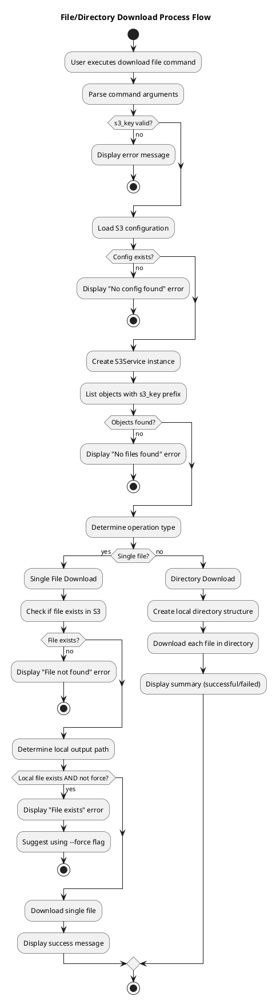
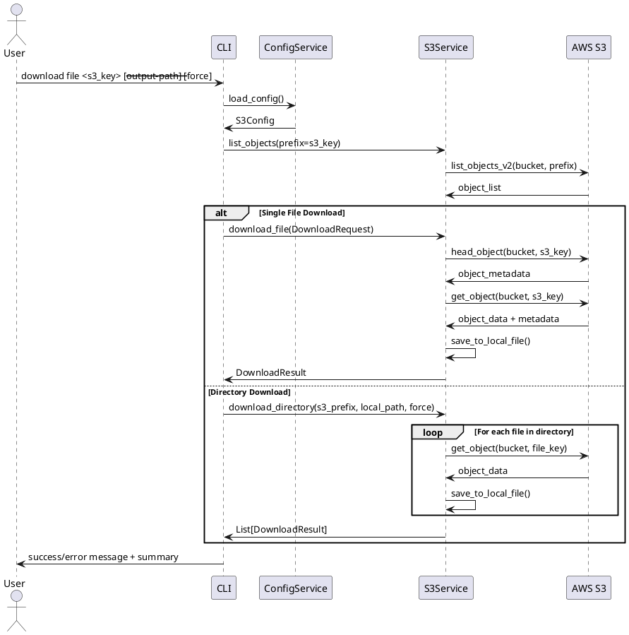
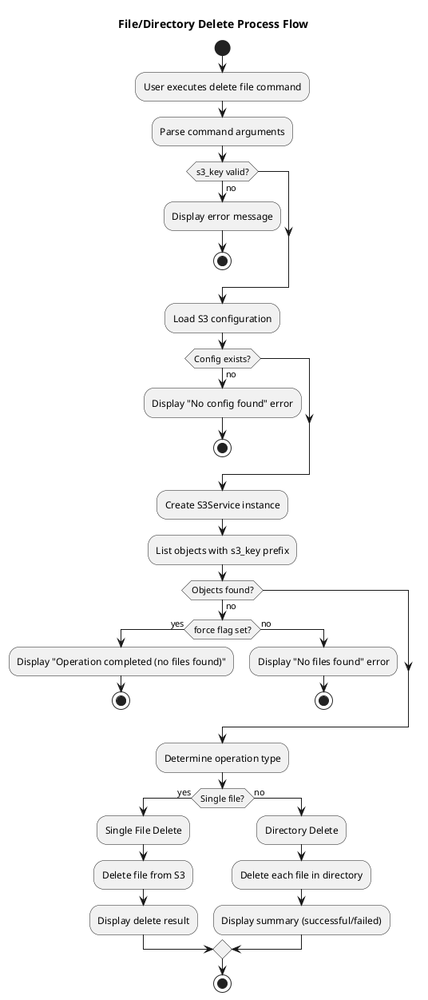
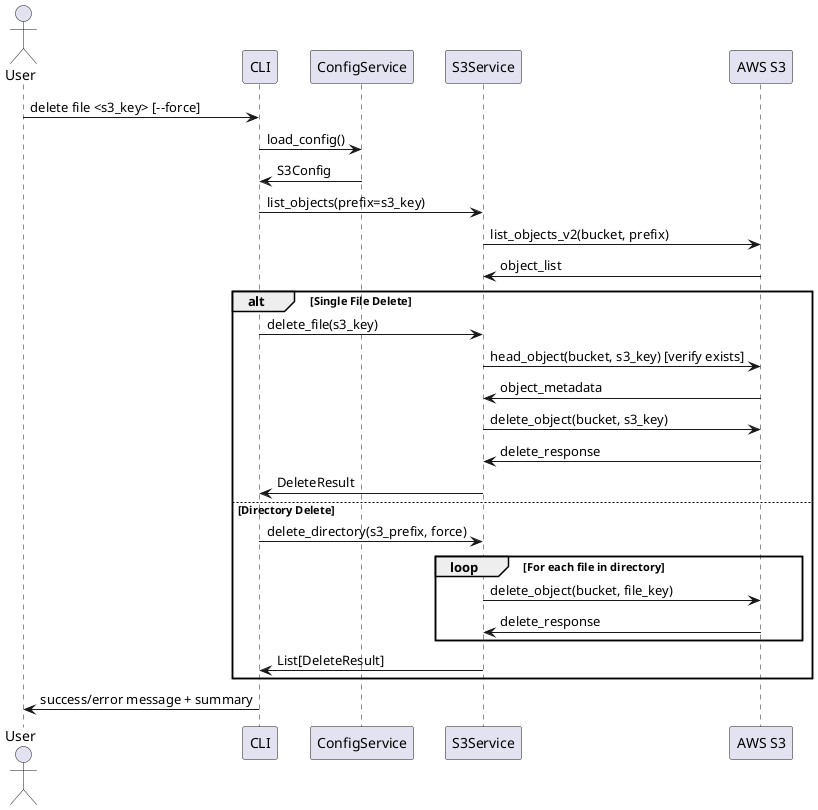

# Download and Delete Feature Process Flow Design

## 概要
在既有的檔案上傳和列表功能基礎上，新增檔案下載和刪除功能。這兩個功能將遵循既有的分層架構設計，確保與現有系統的一致性和未來 Web UI 擴充的相容性。

## 1. 統一檔案/目錄下載處理流程

### 1.1 下載功能流程圖


### 1.2 下載時序圖


### 1.3 下載處理步驟
1. **參數驗證**: 驗證 s3_key 參數，檢查輸出路徑（如有指定）
2. **配置載入**: 載入 S3 配置檔案
3. **S3 連線**: 建立與 S3 的連線
4. **類型檢測**: 通過 list_objects 判斷是單檔案還是目錄
5. **單檔案下載**:
   - 檢查 S3 上是否存在指定的檔案
   - 處理本地路徑衝突（使用 --force 覆寫）
   - 下載檔案到本地
6. **目錄下載**:
   - 遞迴下載目錄中的所有檔案
   - 創建本地目錄結構
   - 批次處理檔案下載
7. **結果回報**: 回報下載成功/失敗，包含詳細統計

## 2. 統一檔案/目錄刪除處理流程

### 2.1 刪除功能流程圖


### 2.2 刪除時序圖


### 2.3 刪除處理步驟
1. **參數驗證**: 驗證 s3_key 參數
2. **配置載入**: 載入 S3 配置檔案
3. **S3 連線**: 建立與 S3 的連線
4. **類型檢測**: 通過 list_objects 判斷是單檔案還是目錄
5. **單檔案刪除**:
   - 檢查並刪除指定檔案
   - 回報檔案是否存在及刪除結果
6. **目錄刪除**:
   - 遞迴刪除目錄中的所有檔案
   - 批次處理檔案刪除
7. **結果回報**: 回報刪除成功/失敗，包含詳細統計

## 3. 統一 Upload 命令結構

### 3.1 統一上傳命令設計
為了保持一致性，upload 命令也已統一為 file 命令：

```bash
# Upload single file
cloud-storage-syncer upload file <local_path> [--s3-key <key>]

# Upload directory (automatic detection)
cloud-storage-syncer upload file <local_directory> [--s3-key <prefix>] [--recursive]
```

**變更說明**：
- 移除了獨立的 `directory` 和 `batch` 命令
- 統一使用 `file` 命令，自動檢測文件或目錄類型
- 保持 `--recursive` 選項用於目錄上傳

## 4. CLI Command Structure Design

### 4.1 Upload Commands (Updated)
```bash
# Upload single file
cloud-storage-syncer upload file <local_path> [--s3-key <key>] [--storage-class <class>]

# Upload directory with recursive flag
cloud-storage-syncer upload file <local_directory> [--s3-key <prefix>] [--recursive] [--storage-class <class>]
```

### 4.2 Download Commands
```bash
# Download single file to current directory with original filename
cloud-storage-syncer download file <s3_key>

# Download single file to specified path
cloud-storage-syncer download file <s3_key> --output-path /local/path/filename.ext

# Download directory (auto-detected by S3 prefix match)
cloud-storage-syncer download file <s3_key_prefix> [--output-path /local/directory/]

# Force overwrite existing files
cloud-storage-syncer download file <s3_key> --force
```

### 4.3 Delete Commands
```bash
# Delete single file (auto-detected)
cloud-storage-syncer delete file <s3_key>

# Delete directory (auto-detected by S3 prefix match)
cloud-storage-syncer delete file <s3_key_prefix>

# Force deletion (suppress "not found" errors)
cloud-storage-syncer delete file <s3_key> --force
```

## 5. 錯誤處理設計

### 5.1 下載錯誤處理
- **S3 key 不存在**: 明確提示檔案不存在
- **權限不足**: 提示存取權限問題
- **本地檔案已存在**: 提示使用 --force 覆蓋現有檔案
- **磁碟空間不足**: 提示磁碟空間不足
- **網路連線問題**: 提示網路連線失敗，建議重試
- **目錄下載部分失敗**: 顯示成功/失敗統計，列出失敗檔案詳情

### 5.2 刪除錯誤處理
- **S3 key 不存在**:
  - 預設：明確提示檔案不存在並退出
  - `--force` 模式：靜默完成，提示 "操作完成（未找到檔案）"
- **權限不足**: 提示刪除權限問題
- **網路連線問題**: 提示網路連線失敗，建議重試
- **目錄刪除部分失敗**: 顯示成功/失敗統計，列出失敗檔案詳情

### 5.3 統一參數處理
- **--force 參數**:
  - 下載：覆蓋現有本地檔案
  - 刪除：抑制 "檔案不存在" 錯誤
  - 通用：跳過所有非關鍵錯誤檢查

## 6. 與現有架構整合

### 6.1 保持一致性
- 使用相同的 ConfigService 和 S3Service
- 遵循相同的錯誤處理模式
- 保持相同的 CLI 風格和使用者體驗
- **統一命令結構**：所有操作都使用 `file` 命令，自動檢測類型

### 6.2 架構改進
- **簡化命令結構**：減少命令數量，提升用戶體驗
- **智能檢測**：自動識別單檔案 vs 目錄操作
- **統一參數**：`--force` 參數在所有操作中有一致的語義
- **批次操作**：原生支援目錄級別的批次操作

### 6.3 擴充點設計
- 預留更複雜檔案過濾功能的擴充空間
- 設計可用於未來 Web UI 的 API 介面
- 保持與其他雲端服務擴充的相容性

## 7. 實現摘要

### 7.1 主要功能
1. **Upload Commands**: 統一的 `file` 命令支援檔案和目錄上傳
2. **Download Commands**: 完整的下載功能，支援單檔案和目錄
3. **Delete Commands**: 完整的刪除功能，支援單檔案和目錄
4. **智能檢測**: 透過 S3 object listing 自動判斷操作類型
5. **統一參數**: 使用 `--force` 提供一致的行為控制

### 7.2 系統特性
- 保持所有現有 API 不變
- CLI 命令結構簡化但功能完整
- 配置檔案格式無變更
