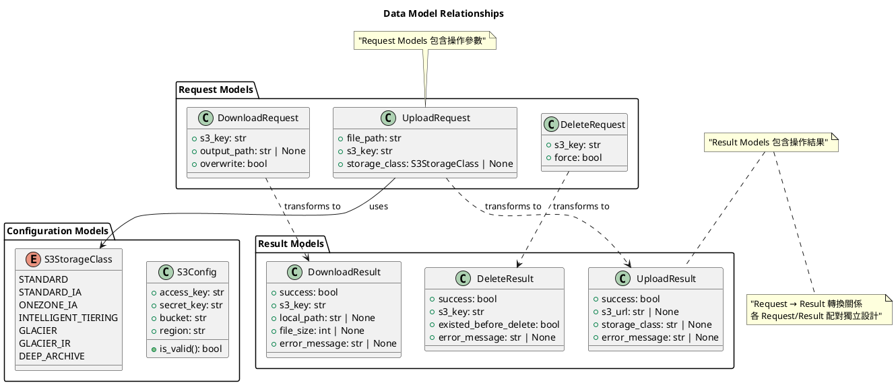
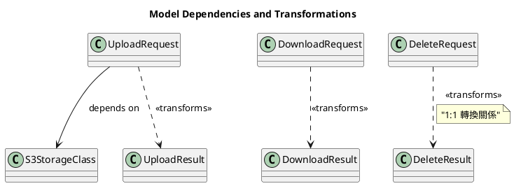

# Data Model Design for Download and Delete Features

## 概要
為支援下載和刪除功能，需要新增相應的資料模型來處理請求和回應。這些模型將遵循既有的設計模式，確保系統一致性。

## 0. 全體資料結構關聯圖

### 0.1 Model 類別關係圖

### 0.2 Model 繼承與依賴關係

## 1. Model 類別設計概要

### 1.1 Configuration Models
- **S3Config**: 系統配置模型
- **S3StorageClass**: 儲存等級枚舉

### 1.2 Request Models
- **UploadRequest**: 上傳請求模型
- **DownloadRequest**: 下載請求模型（新增）
- **DeleteRequest**: 刪除請求模型（新增）

### 1.3 Result Models
- **UploadResult**: 上傳結果模型
- **DownloadResult**: 下載結果模型（新增）
- **DeleteResult**: 刪除結果模型（新增）

## 2. Model 關係分析

### 2.1 依賴關係 (Dependency)
- UploadRequest → S3StorageClass: 上傳請求依賴儲存等級配置

### 2.2 轉換關係 (Transformation)
- UploadRequest → UploadResult: 1:1 請求-結果轉換
- DownloadRequest → DownloadResult: 1:1 請求-結果轉換
- DeleteRequest → DeleteResult: 1:1 請求-結果轉換

### 2.3 模型分組
- **配置模型組**: S3Config, S3StorageClass
- **操作模型組**: Request/Result 配對
- **功能模型組**: Upload, Download, Delete 各自獨立

## 3. 設計原則

### 3.1 獨立性原則
- 各 Request/Result 配對獨立設計
- 不強制繼承共同介面
- 保持模型簡潔性

### 3.2 一致性原則
- 相同的錯誤處理模式（error_message 欄位）
- 相同的成功標示模式（success 欄位）
- 相同的工廠方法命名慣例

### 3.3 擴充性原則
- 模型設計支援未來功能擴充
- 預留批次操作的設計空間
