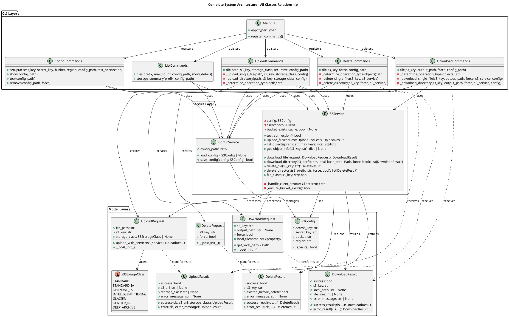
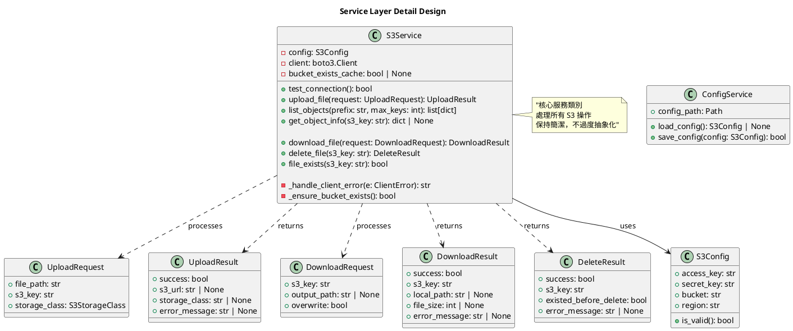

# Class and Interface Design

## 概要
定義下載和刪除功能所需的類別、方法和介面設計。遵循 SOLID 原則，確保代碼的可維護性和擴展性。

## 0. 完整系統類別關係 UML 圖

### 0.1 系統完整架構圖（包含所有類別）


### 0.2 Service 層詳細設計


## 1. S3Service 擴充設計

### 1.1 新增方法定義

**檔案位置**: `src/cloud_storage_syncer/services/s3_service.py`

```python
class S3Service:
    # ... 既有方法 ...

    def download_file(self, request: DownloadRequest) -> DownloadResult:
        """Download a file from S3 to local filesystem.

        Args:
            request: Download request with S3 key and output path

        Returns:
            DownloadResult with success/failure information
        """

    def delete_file(self, s3_key: str) -> DeleteResult:
        """Delete a file from S3.

        Args:
            s3_key: S3 object key to delete

        Returns:
            DeleteResult with success/failure information
        """

    def file_exists(self, s3_key: str) -> bool:
        """Check if a file exists in S3.

        Args:
            s3_key: S3 object key to check

        Returns:
            True if file exists, False otherwise
        """
```

### 1.2 方法實作邏輯

#### 1.2.1 download_file 方法

```python
def download_file(self, request: DownloadRequest) -> DownloadResult:
    """Download a file from S3 to local filesystem."""
    try:
        # 1. 檢查 S3 檔案是否存在
        if not self.file_exists(request.s3_key):
            return DownloadResult.error_result(
                request.s3_key,
                f"File not found in S3: {request.s3_key}"
            )

        # 2. 確定本地儲存路徑
        local_path = request.get_local_path()

        # 3. 檢查本地檔案是否已存在
        if local_path.exists() and not request.force:
            return DownloadResult.error_result(
                request.s3_key,
                f"Local file already exists: {local_path}"
            )

        # 4. 建立目標目錄（如果不存在）
        local_path.parent.mkdir(parents=True, exist_ok=True)

        # 5. 下載檔案
        self.client.download_file(
            self.config.bucket,
            request.s3_key,
            str(local_path)
        )

        # 6. 取得檔案大小
        file_size = local_path.stat().st_size

        return DownloadResult.success_result(
            request.s3_key,
            str(local_path),
            file_size
        )

    except ClientError as e:
        # 處理 AWS 相關錯誤

    except Exception as e:
        # 處理其他意外錯誤
```

#### 1.2.2 delete_file 方法

```python
def delete_file(self, s3_key: str) -> DeleteResult:
    """Delete a file from S3."""
    try:
        # 1. 檢查檔案是否存在
        existed = self.file_exists(s3_key)

        # 2. 執行刪除操作
        self.client.delete_object(
            Bucket=self.config.bucket,
            Key=s3_key
        )

        return DeleteResult.success_result(s3_key, existed)

    except ClientError as e:
        # 處理 AWS 相關錯誤

    except Exception as e:
        # 處理其他意外錯誤
```

## 2. CLI Commands 設計

### 2.1 Download Commands

**檔案位置**: `src/cloud_storage_syncer/cli/commands/download_commands.py`

```python
"""Download commands for the CLI."""

from pathlib import Path
from typing import Annotated

import typer

from ...models import DownloadRequest
from ...services import ConfigService, S3Service

app = typer.Typer()

@app.command()
def file(
    s3_key: Annotated[
        str, typer.Argument(help="S3 key (file or directory prefix) to download")
    ],
    output_path: Annotated[
        str | None,
        typer.Option("--output-path", "-o", help="Local output path (file or directory)"),
    ] = None,
    force: Annotated[
        bool, typer.Option("--force", help="Overwrite existing files")
    ] = False,
    config_path: Annotated[
        Path | None, typer.Option(help="Config file path")
    ] = None,
):
    """Download a file or directory from S3."""
```

### 2.2 Delete Commands

**檔案位置**: `src/cloud_storage_syncer/cli/commands/delete_commands.py`

```python
"""Delete commands for the CLI."""

from pathlib import Path
from typing import Annotated

import typer

from ...services import ConfigService, S3Service

app = typer.Typer()

@app.command()
def file(
    s3_key: Annotated[str, typer.Argument(help="S3 key of file to delete")],
    force: Annotated[
        bool, typer.Option("--force", "-f", help="Skip confirmation prompt")
    ] = False,
    config_path: Annotated[
        Path | None, typer.Option(help="Config file path")
    ] = None,
):
    """Delete a single file from S3."""
```

## 3. CLI 主程式整合

### 3.1 更新主 CLI 應用程式

**檔案位置**: `src/cloud_storage_syncer/cli/main.py`

```python
# 需要新增 import
from .commands import download_commands, delete_commands

# 新增命令群組註冊
app.add_typer(download_commands.app, name="download", help="Download files from S3")
app.add_typer(delete_commands.app, name="delete", help="Delete files from S3")
```

## 4. 錯誤處理和使用者體驗設計

### 4.1 一致的錯誤訊息格式
- 使用相同的 emoji 和訊息格式
- 提供建議的解決方案
- 區分不同類型的錯誤（使用者錯誤 vs 系統錯誤）

### 4.2 確認對話設計
```python
def confirm_deletion(s3_key: str) -> bool:
    """Ask user to confirm file deletion."""
    return typer.confirm(
        f"⚠️  Are you sure you want to delete '{s3_key}' from S3?",
        default=False
    )
```

## 5. 擴充性考量

### 5.1 批次操作預留
- Command 結構設計支援未來批次下載/刪除功能
- Service 方法設計支援列表參數

### 5.2 進度顯示預留
- 大檔案下載時的進度條支援
- 批次操作時的進度統計

### 5.3 Web API 相容性
- Service 層的設計完全獨立於 CLI
- 可直接用於未來的 REST API 實作

## 6. 測試介面設計

### 6.1 單元測試所需的 Mock 點
- S3Client 的 download_file, delete_object, head_object 方法
- 本地檔案系統操作
- 使用者確認對話

### 6.2 整合測試考量
- 實際 S3 環境測試
- 檔案權限和磁碟空間測試
- 網路異常情況測試
