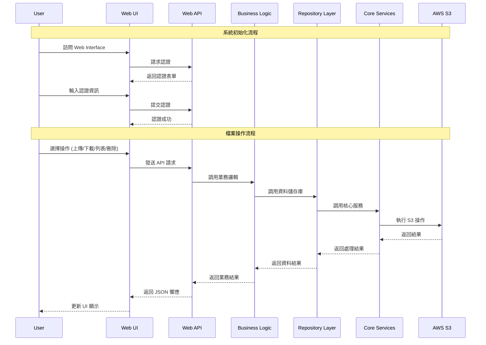
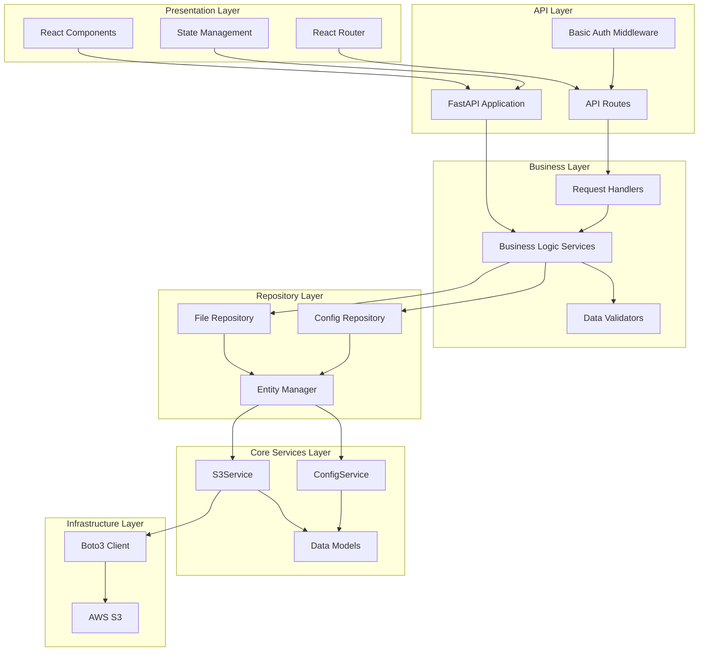
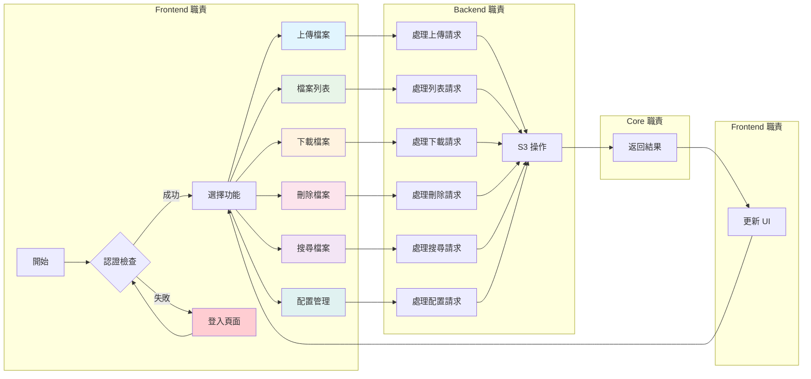

# Web Interface - Overview Process Flow

## 使用者操作流程

```mermaid
sequenceDiagram
    participant U as User
    participant W as Web UI
    participant A as Web API
    participant BL as Business Logic
    participant R as Repository Layer
    participant S as Core Services
    participant S3 as AWS S3

    Note over U,S3: 系統初始化流程
    U->>W: 訪問 Web Interface
    W->>A: 請求認證
    A-->>W: 返回認證表單
    U->>W: 輸入認證資訊
    W->>A: 提交認證
    A-->>W: 認證成功

    Note over U,S3: 檔案操作流程
    U->>W: 選擇操作 (上傳/下載/列表/刪除)
    W->>A: 發送 API 請求
    A->>BL: 調用業務邏輯
    BL->>R: 調用資料儲存庫
    R->>S: 調用核心服務
    S->>S3: 執行 S3 操作
    S3-->>S: 返回結果
    S-->>R: 返回處理結果
    R-->>BL: 返回資料結果
    BL-->>A: 返回業務結果
    A-->>W: 返回 JSON 響應
        W-->>U: 更新 UI 顯示

## 核心功能流程
```

## 系統架構層次

```mermaid
graph TD
    subgraph "Presentation Layer"
        React[React Components]
        Router[React Router]
        State[State Management]
    end

    subgraph "API Layer"
        FastAPI[FastAPI Application]
        Auth[Basic Auth Middleware]
        Routes[API Routes]
    end

    subgraph "Business Layer"
        BusinessLogic[Business Logic Services]
        Validators[Data Validators]
        Handlers[Request Handlers]
    end

    subgraph "Repository Layer"
        FileRepository[File Repository]
        ConfigRepository[Config Repository]
        EntityManager[Entity Manager]
    end

    subgraph "Core Services Layer"
        S3Svc[S3Service]
        ConfigSvc[ConfigService]
        Models[Data Models]
    end

    subgraph "Infrastructure Layer"
        Boto3[Boto3 Client]
        S3Storage[AWS S3]
    end

    React --> FastAPI
    Router --> Routes
    State --> FastAPI
    FastAPI --> BusinessLogic
    Routes --> Handlers
    Auth --> Routes
    BusinessLogic --> Validators
    Handlers --> BusinessLogic
    BusinessLogic --> FileRepository
    BusinessLogic --> ConfigRepository
    FileRepository --> EntityManager
    ConfigRepository --> EntityManager
    EntityManager --> S3Svc
    EntityManager --> ConfigSvc
    S3Svc --> Models
    ConfigSvc --> Models
    S3Svc --> Boto3
    Boto3 --> S3Storage
```

## 核心功能流程

```mermaid
flowchart LR
    subgraph "Frontend 職責"
        Start[開始] --> Auth{認證檢查}
        Auth -->|成功| Menu[選擇功能]
        Auth -->|失敗| Login[登入頁面]
        Login --> Auth

        Menu --> Upload[上傳檔案]
        Menu --> List[檔案列表]
        Menu --> Download[下載檔案]
        Menu --> Delete[刪除檔案]
        Menu --> Search[搜尋檔案]
        Menu --> Config[配置管理]
    end

    subgraph "Backend 職責"
        Upload --> UploadProcess[處理上傳請求]
        List --> ListProcess[處理列表請求]
        Download --> DownloadProcess[處理下載請求]
        Delete --> DeleteProcess[處理刪除請求]
        Search --> SearchProcess[處理搜尋請求]
        Config --> ConfigProcess[處理配置請求]

        UploadProcess --> S3Op[S3 操作]
        ListProcess --> S3Op
        DownloadProcess --> S3Op
        DeleteProcess --> S3Op
        SearchProcess --> S3Op
        ConfigProcess --> S3Op
    end

    subgraph "Core 職責"
        S3Op --> Result[返回結果]
    end

    subgraph "Frontend 職責"
        Result --> UI[更新 UI]
        UI --> Menu
    end

    style Login fill:#ffcdd2
    style Upload fill:#e1f5fe
    style List fill:#e8f5e8
    style Download fill:#fff3e0
    style Delete fill:#fce4ec
    style Search fill:#f3e5f5
    style Config fill:#e0f2f1
```
