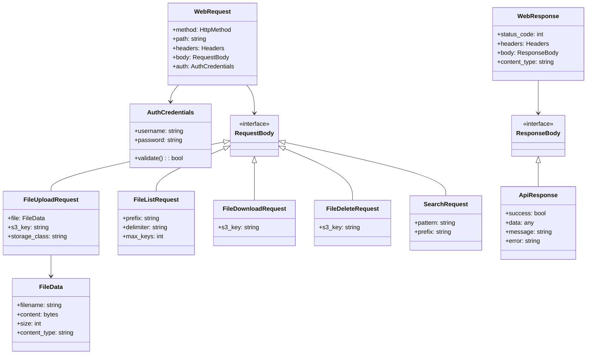
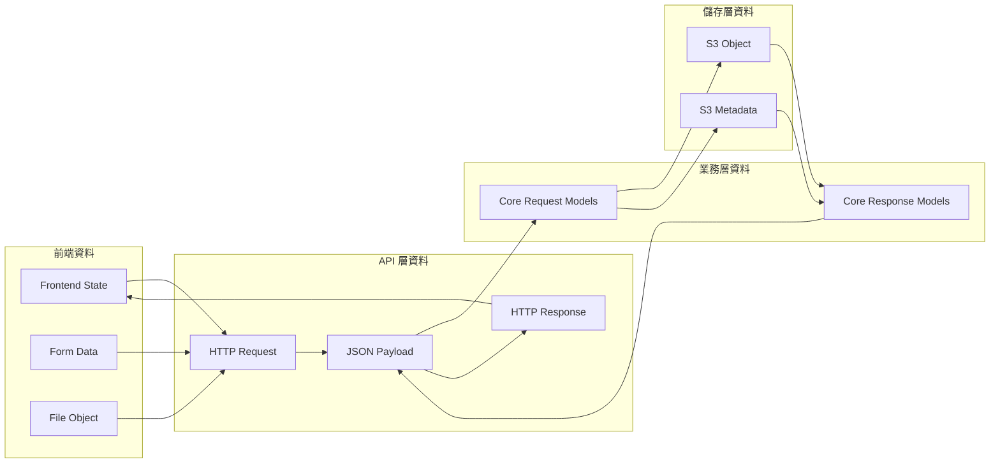
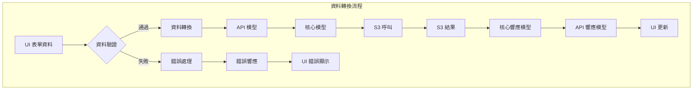
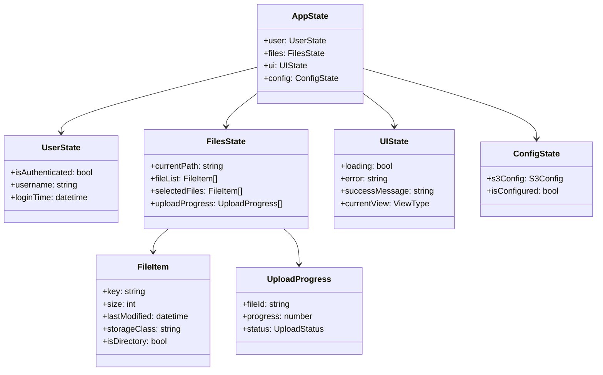

# Web Interface - Overview Data Model

## 整體資料模型架構

```mermaid
classDiagram
    class WebRequest {
        +method: HttpMethod
        +path: string
        +headers: Headers
        +body: RequestBody
        +auth: AuthCredentials
    }

    class WebResponse {
        +status_code: int
        +headers: Headers
        +body: ResponseBody
        +content_type: string
    }

    class AuthCredentials {
        +username: string
        +password: string
        +validate(): bool
    }

    class RequestBody {
        <<interface>>
    }

    class ResponseBody {
        <<interface>>
    }

    class FileUploadRequest {
        +file: FileData
        +s3_key: string
        +storage_class: string
    }

    class FileListRequest {
        +prefix: string
        +delimiter: string
        +max_keys: int
    }

    class FileDownloadRequest {
        +s3_key: string
    }

    class FileDeleteRequest {
        +s3_key: string
    }

    class SearchRequest {
        +pattern: string
        +prefix: string
    }

    class ApiResponse {
        +success: bool
        +data: any
        +message: string
        +error: string
    }

    class FileData {
        +filename: string
        +content: bytes
        +size: int
        +content_type: string
    }

    WebRequest --> AuthCredentials
    WebRequest --> RequestBody
    WebResponse --> ResponseBody

    RequestBody <|-- FileUploadRequest
    RequestBody <|-- FileListRequest
    RequestBody <|-- FileDownloadRequest
    RequestBody <|-- FileDeleteRequest
    RequestBody <|-- SearchRequest

    ResponseBody <|-- ApiResponse

    FileUploadRequest --> FileData
```

## 核心業務資料流

```mermaid
graph LR
    subgraph "前端資料"
        FE_State[Frontend State]
        FE_Form[Form Data]
        FE_File[File Object]
    end

    subgraph "API 層資料"
        HTTP_Req[HTTP Request]
        HTTP_Res[HTTP Response]
        JSON_Data[JSON Payload]
    end

    subgraph "業務層資料"
        Core_Req[Core Request Models]
        Core_Res[Core Response Models]
    end

    subgraph "儲存層資料"
        S3_Obj[S3 Object]
        S3_Meta[S3 Metadata]
    end

    FE_State --> HTTP_Req
    FE_Form --> HTTP_Req
    FE_File --> HTTP_Req

    HTTP_Req --> JSON_Data
    JSON_Data --> Core_Req

    Core_Req --> S3_Obj
    Core_Req --> S3_Meta

    S3_Meta --> Core_Res
    S3_Obj --> Core_Res

    Core_Res --> JSON_Data
    JSON_Data --> HTTP_Res

    HTTP_Res --> FE_State
```

## 資料轉換關係

```mermaid
flowchart TD
    subgraph "資料轉換流程"
        UI_Data[UI 表單資料] --> Validate{資料驗證}
        Validate -->|通過| Transform[資料轉換]
        Validate -->|失敗| Error[錯誤處理]

        Transform --> API_Model[API 模型]
        API_Model --> Core_Model[核心模型]
        Core_Model --> S3_Call[S3 呼叫]

        S3_Call --> S3_Result[S3 結果]
        S3_Result --> Core_Response[核心響應模型]
        Core_Response --> API_Response[API 響應模型]
        API_Response --> UI_Update[UI 更新]

        Error --> Error_Response[錯誤響應]
        Error_Response --> UI_Error[UI 錯誤顯示]
    end
```

## 狀態管理資料模型

```mermaid
classDiagram
    class AppState {
        +user: UserState
        +files: FilesState
        +ui: UIState
        +config: ConfigState
    }

    class UserState {
        +isAuthenticated: bool
        +username: string
        +loginTime: datetime
    }

    class FilesState {
        +currentPath: string
        +fileList: FileItem[]
        +selectedFiles: FileItem[]
        +uploadProgress: UploadProgress[]
    }

    class UIState {
        +loading: bool
        +error: string
        +successMessage: string
        +currentView: ViewType
    }

    class ConfigState {
        +s3Config: S3Config
        +isConfigured: bool
    }

    class FileItem {
        +key: string
        +size: int
        +lastModified: datetime
        +storageClass: string
        +isDirectory: bool
    }

    class UploadProgress {
        +fileId: string
        +progress: number
        +status: UploadStatus
    }

    AppState --> UserState
    AppState --> FilesState
    AppState --> UIState
    AppState --> ConfigState

    FilesState --> FileItem
    FilesState --> UploadProgress
```
