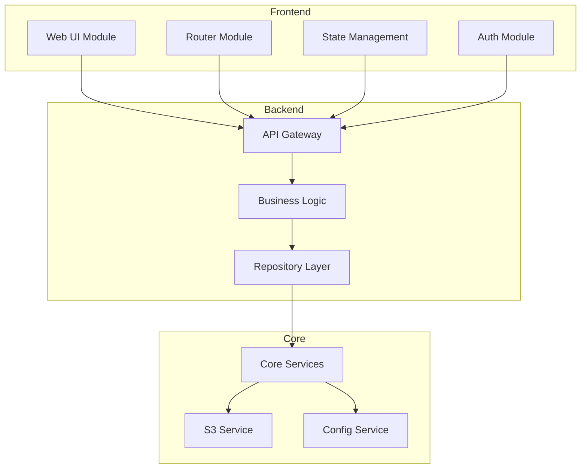
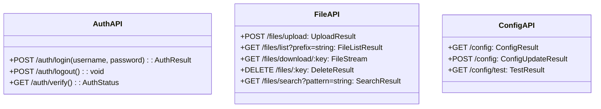
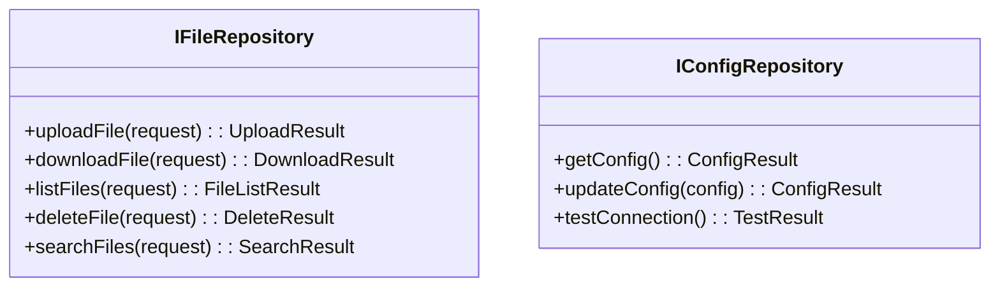
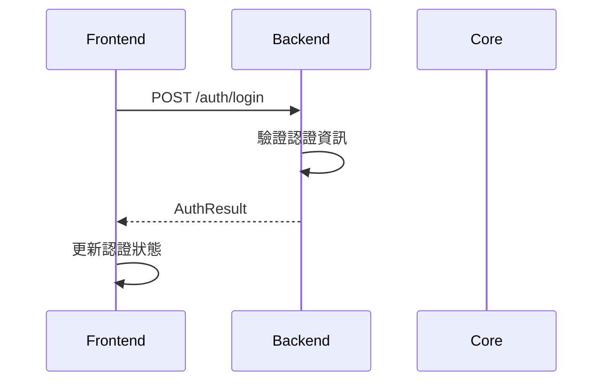
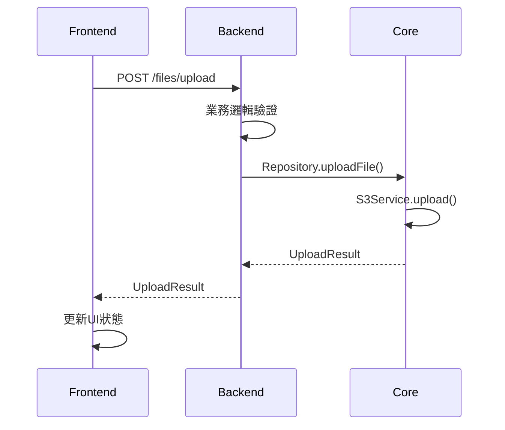
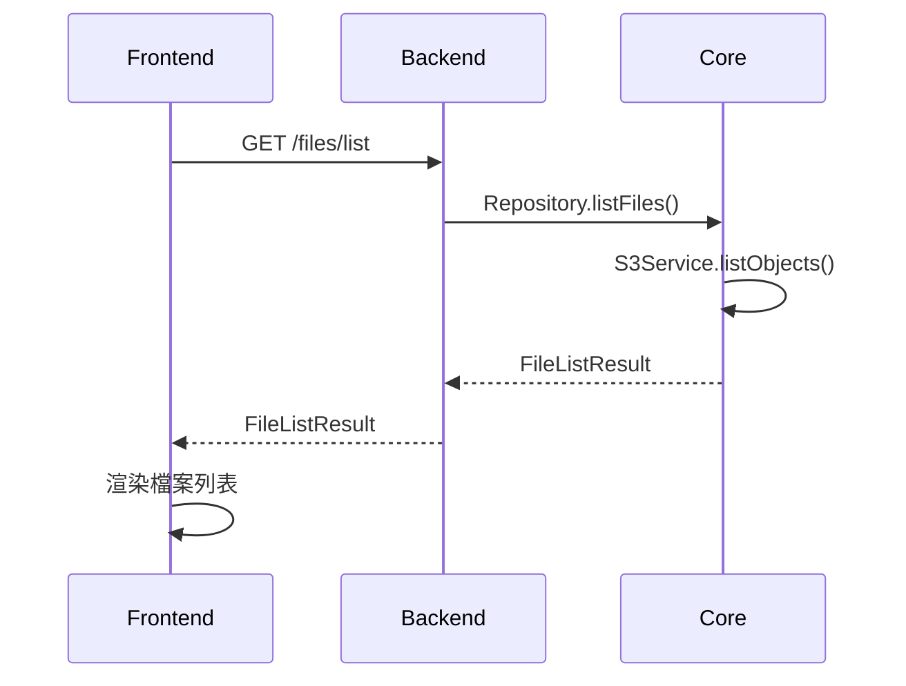
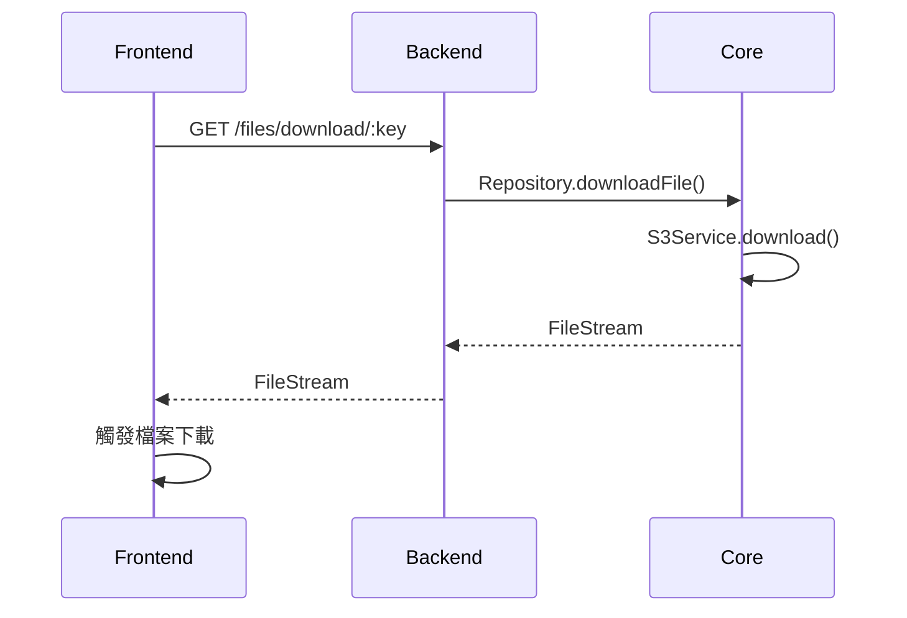
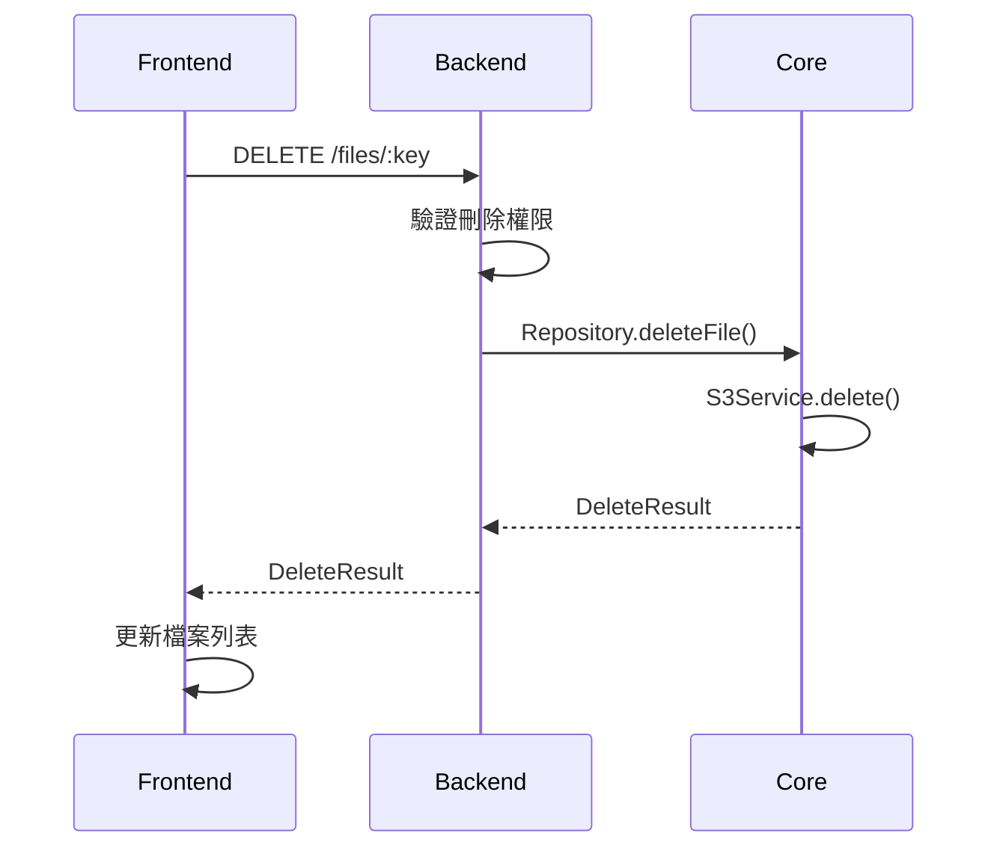
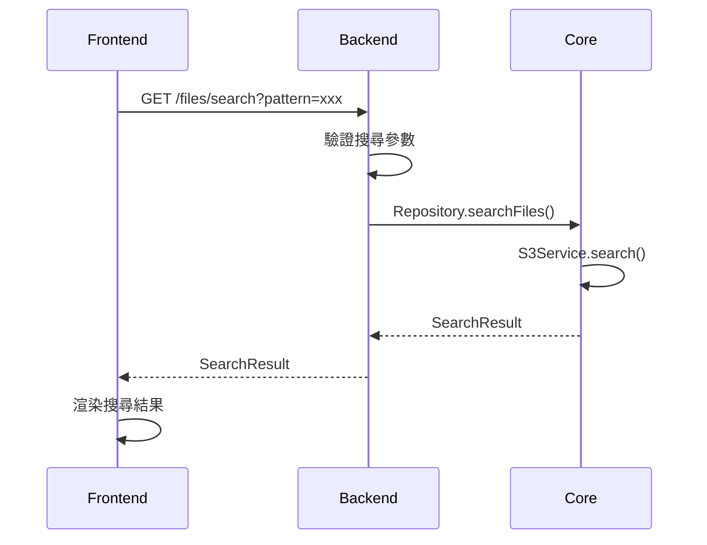
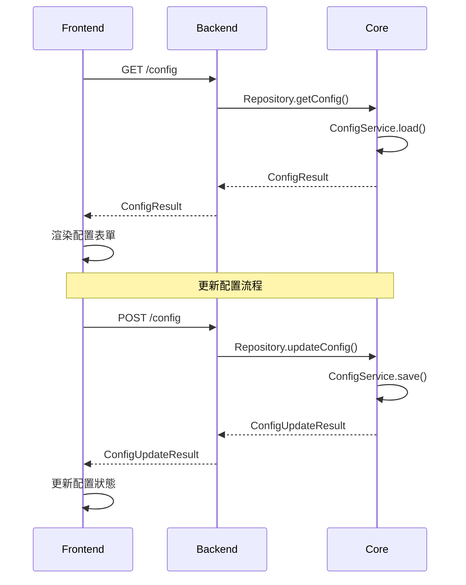

# Web Interface - Overview System Interface

## 完整系統架構層次

## 介面規範定義

### Frontend -> Backend API

### Backend -> Core Interface

## 各模組時序圖

### 1. 登入頁面

### 2. 上傳檔案

### 3. 檔案列表

### 4. 下載檔案

### 5. 刪除檔案

### 6. 搜尋檔案

### 7. 配置管理

