# CloudStorageSyncer

A powerful command-line tool for managing AWS S3 storage with complete CRUD operations.

## 🚀 Core Operations

```mermaid
flowchart TD
    CLI[CloudStorageSyncer CLI] --> Upload[📤 Upload]
    CLI --> List[📋 List/Search]
    CLI --> Download[📥 Download]
    CLI --> Delete[🗑️ Delete]

    Upload --> S3[(AWS S3 Bucket)]
    List --> S3
    Download --> S3
    Delete --> S3

    style CLI fill:#e1f5fe
    style S3 fill:#fff3e0
```



### Quick Examples

```bash
# Setup configuration
uv run cloud-storage-syncer config setup

# Upload file/directory
uv run cloud-storage-syncer upload file ./myfile.txt --s3-key folder/myfile.txt
uv run cloud-storage-syncer upload file ./myfolder/ --recursive

# List & Search
uv run cloud-storage-syncer list files --prefix folder/
uv run cloud-storage-syncer list search --pattern "*.jpg"

# Download file/directory
uv run cloud-storage-syncer download file folder/myfile.txt --output-path ./downloaded.txt
uv run cloud-storage-syncer download file folder/ --output-path ./downloaded-folder/

# Delete file/directory
uv run cloud-storage-syncer delete file folder/myfile.txt
uv run cloud-storage-syncer delete file folder/
```

## 🛠️ Installation & Setup

### Prerequisites
- Python 3.13+ with [uv](https://docs.astral.sh/uv/) package manager
- AWS S3 credentials

### Installation
```bash
git clone https://github.com/FATESAIKOU/CloudStorageSyncer.git
cd CloudStorageSyncer
uv sync
```

### Configuration
```bash
# Interactive setup
uv run cloud-storage-syncer config setup

# Or specify directly
uv run cloud-storage-syncer config setup \
  --access-key YOUR_KEY --secret-key YOUR_SECRET \
  --bucket YOUR_BUCKET --region us-west-2

# Test connection
uv run cloud-storage-syncer config test
```

## 📚 Command Reference

### File Operations
```bash
# Upload file
uv run cloud-storage-syncer upload file ./doc.pdf --s3-key docs/doc.pdf

# Download file
uv run cloud-storage-syncer download file docs/doc.pdf --output-path ./doc.pdf

# List files
uv run cloud-storage-syncer list files --prefix docs/

# Search files by pattern
uv run cloud-storage-syncer list search --pattern "*.pdf"

# Delete file
uv run cloud-storage-syncer delete file docs/doc.pdf
```

### Directory Operations
```bash
# Upload directory recursively
uv run cloud-storage-syncer upload file ./my-folder/ --s3-key remote-folder/ --recursive

# Download directory
uv run cloud-storage-syncer download file remote-folder/ --output-path ./local-folder/

# Delete directory (all files with prefix)
uv run cloud-storage-syncer delete file remote-folder/
```

### Storage Classes
Use `--storage-class` with upload:
- `STANDARD` (default), `INTELLIGENT_TIERING`, `STANDARD_IA`
- `GLACIER_IR`, `GLACIER`, `DEEP_ARCHIVE`

## 🏗️ Architecture


## 🧪 Development

### Testing
```bash
uv run pytest                           # Run tests
uv run pytest --cov --cov-report=html   # With coverage
```

### Code Quality
```bash
uv run ruff check                       # Lint code
uv run ruff format                      # Format code
uv run pre-commit install               # Install hooks
```

### Docker
```bash
docker build -t cloud-storage-syncer .
docker run --rm cloud-storage-syncer version
```

## 🤝 Contributing

1. Fork → Create branch → Make changes → Test → Submit PR
2. Follow code style (ruff) and write tests
3. Update docs as needed

## 📋 Requirements

- **Runtime**: Python 3.13+, boto3, typer
- **Development**: pytest, ruff, pre-commit
- **Config**: `~/.cloud-storage-syncer/config.yaml` or ENV vars

## 📄 License

MIT License

## 👤 Author

FATESAIKOU
